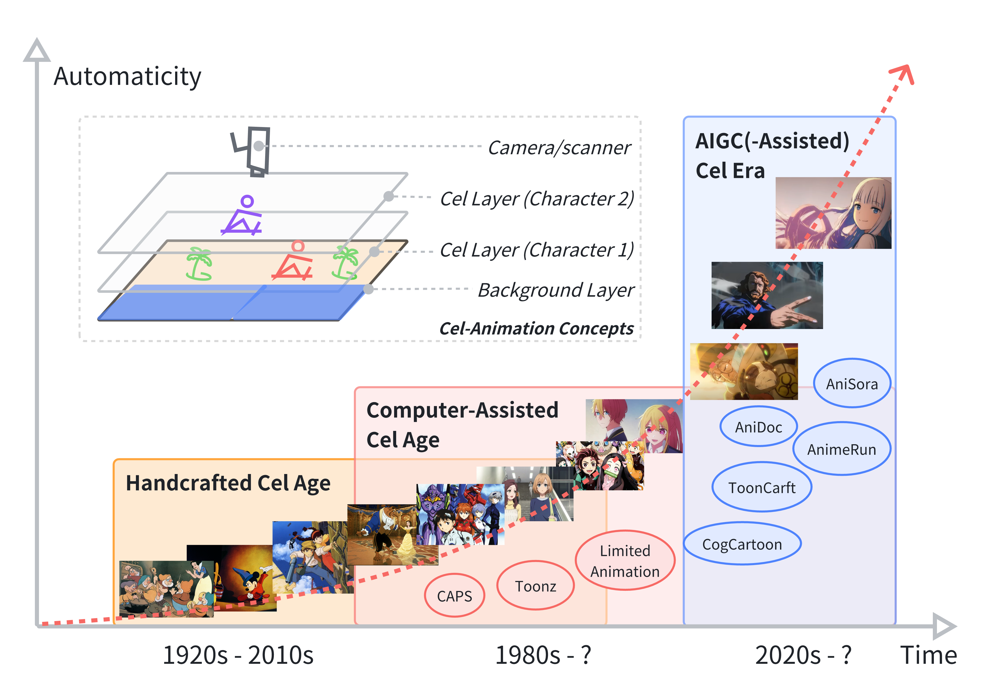
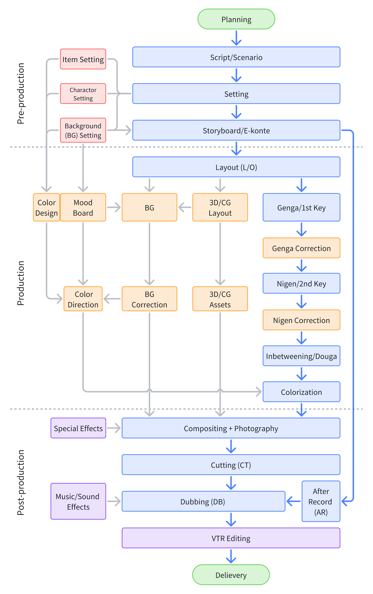
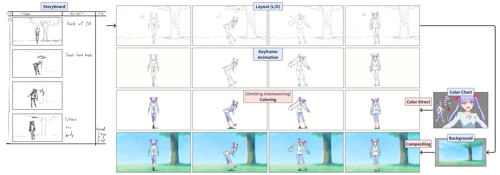
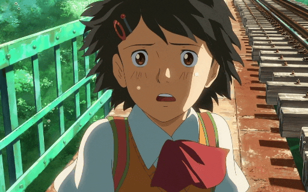
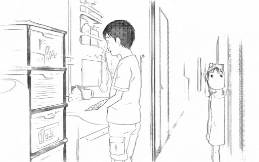
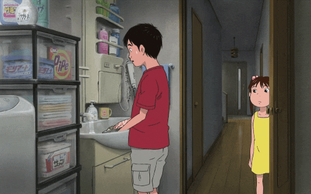
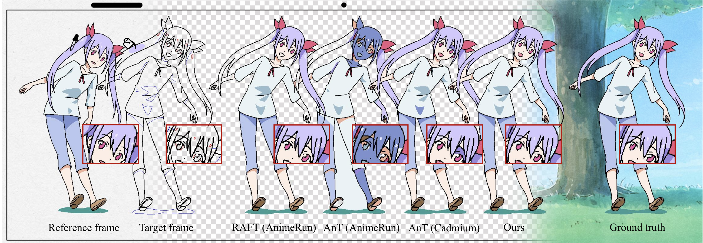
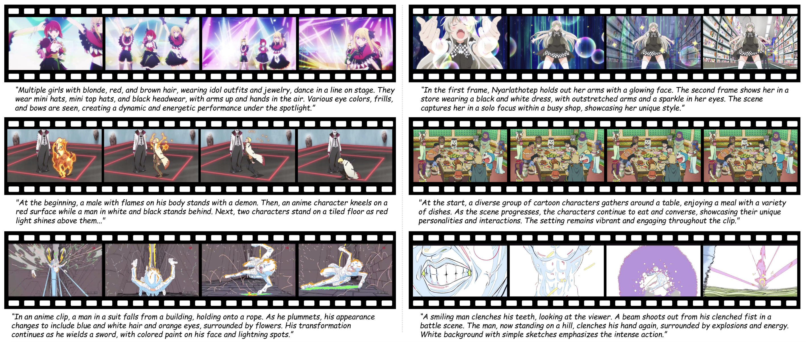

# Awesome Gen AI for Animation 

### 🔥🔥🔥 [Generative AI for Cel-Animation: A Survey](https://arxiv.org/abs/2501.06250)

> *Yunlong Tang1, Junjia Guo1, Pinxin Liu1, Zhiyuan Wang2, Hang Hua1, Jia-Xing Zhong3, Yunzhong Xiao4, Chao Huang1, Luchuan Song1, Susan Liang1, Yizhi Song5, Liu He5, Jing Bi1,\*, Mingqian Feng1, Xinyang Li1, Zeliang Zhang1, Chenliang Xu1*  

*1University of Rochester, 2UCSB, 3University of Oxford, 4CMU, 5Purdue University*

<h5 align="center">  

 **[Paper](https://arxiv.org/abs/2501.06250)** | **[Project Page](https://github.com/yunlong10/Awesome-AI4Animation)**

</h5>

## 📖 Table of Contents

<table>
  <tr>
    <td style="vertical-align: top; padding-right: 10px;">
      
      <ul>
        <li>🛠️ <a href="#%EF%B8%8F-methods">Methods</a>
          <ul>
            <li>1️⃣ <a href="#pre-production">Pre-production</a>
              <ul>
                <li>📜 <a href="#-scripting">Scripting</a></li>
                <li>🎭 <a href="#-setting">Setting</a></li>
                <li>🖌️ <a href="#%EF%B8%8F-storyboarding">Storyboarding</a></li>
              </ul>
            </li>
            <li>2️⃣ <a href="#production">Production</a>
              <ul>
                <li>🗺️ <a href="#%EF%B8%8F-layout">Layout</a></li>
                <li>🎞️ <a href="#keyframe-animation">Keyframe Animation</a></li>
                <li>🍴 <a href="#-inbetweening">Inbetweening</a></li>
                <li>🌈 <a href="#-colorization">Colorization</a></li>
              </ul>
            </li>
            <li>3️⃣ <a href="#post-production">Post-production</a>
              <ul>
                <li>📷 <a href="#-compositing--photography">Compositing & Photography</a></li>
                <li>✂️ <a href="#%EF%B8%8F-cutting-ct">Cutting (CT)</a></li>
                <li>🎶 <a href="#-music--sound-effects">Music & Sound Effects</a></li>
                <li>🎙️ <a href="#%EF%B8%8F-after-record-ar--dubbing-db">After Record (AR) & Dubbing (DB)</a></li>
              </ul>
            </li>
            <li>🔗 <a href="#others">Others</a>
              <ul>
                <li>🎞️ <a href="#%EF%B8%8F-cel-animation-editing">Cel-Animation Editing</a></li>
                <li>🎨 <a href="#-cels-decomposition">Cels Decomposition</a></li>
                <li>🏯 <a href="#-3d-assistance">3D Assistance</a></li>
              </ul>
            </li>
          </ul>
        </li>
        <li>📊 <a href="#-datasets">Datasets</a></li>
      </ul>
    </td>
    <td style="text-align: center; vertical-align: middle;">
      
This is the production process of traditional 2D animation. We will list these research topics roughly in this sequence.

      
    </td>
  </tr>
</table>

A production example showing the transformation of a scene from storyboard to final compositing, demonstrating key stages including layout (L/O), keyframe animation, coloring, and background integration.

## 🛠️ Methods

### 1️⃣ Pre-production

#### 📜 Scripting

| **Model/Paper** | **Authors/Team** | **Links** | **Venue** |
|--------------------------------|--------------------------------|----------|----------|
| [**HoLLMwood: Unleashing the Creativity of Large Language Models in Screenwriting via Role Playing**](https://arxiv.org/abs/2406.11683) | Jing Chen, Xinyu Zhu, Cheng Yang, Chufan Shi, Yadong Xi, Yuxiang Zhang, Junjie Wang, Jiashu Pu, Rongsheng Zhang, Yujiu Yang, Tian Feng |                                                      |              |
| [**Gemini 1.5: Unlocking multimodal understanding across millions of tokens of context**](https://arxiv.org/abs/2403.05530) | Gemini Team Google                                                                                 |                                                      |              |
| [**Claude 3.5 Sonnet**](https://www.anthropic.com/news/claude-3-5-sonnet)                          | Anthropic                                                                                          |                                                      |              |
| [**InternVL: Scaling up Vision Foundation Models and Aligning for Generic Visual-Linguistic Tasks**](https://arxiv.org/abs/2312.14238) | Zhe Chen, Jiannan Wu, Wenhai Wang, Weijie Su, Guo Chen, Sen Xing, Muyan Zhong, Qinglong Zhang, Xizhou Zhu, Lewei Lu, Bin Li, Ping Luo, Tong Lu, Yu Qiao, Jifeng Dai | [Code](https://github.com/OpenGVLab/InternVL)         | CVPR 2024    |
| [**Qwen-VL: A Versatile Vision-Language Model for Understanding, Localization, Text Reading, and Beyond**](https://arxiv.org/abs/2308.12966) | Jinze Bai, Shuai Bai, Shusheng Yang, Shijie Wang, Sinan Tan, Peng Wang, Junyang Lin, Chang Zhou, Jingren Zhou | [Code](https://github.com/QwenLM/Qwen-VL)             |              |
| [**GPT-4**](https://arxiv.org/abs/2303.08774)                                                     | OpenAI                                                                                            |                                                      |              |

#### 🎭 Setting

| **Model/Paper** | **Authors/Team** | **Links** | **Venue** |
|--------------------------------|--------------------------------|----------|----------|
| [**High-Resolution Image Synthesis with Latent Diffusion Models**](https://arxiv.org/abs/2112.10752) | Robin Rombach, Andreas Blattmann, Dominik Lorenz, Patrick Esser, Björn Ommer | [Demo](https://huggingface.co/spaces/multimodalart/latentdiffusion) [Code](https://github.com/CompVis/latent-diffusion) | CVPR 2022     |
| [**MidJourney**](https://www.midjourney.com/home)                                                | MidJourney Team                                                                                     |                                                                                                     |              |

#### 🖌️ Storyboarding

| **Model/Paper** | **Authors/Team** | **Links** | **Venue** |
|--------------------------------|--------------------------------|----------|----------|
| [**StoryWeaver: A Unified World Model for Knowledge-Enhanced Story Character Customization**](https://arxiv.org/abs/2412.07375) | Jinlu Zhang, Jiji Tang, Rongsheng Zhang, Tangjie Lv, Xiaoshuai Sun | [Code](https://github.com/Aria-Zhangjl/StoryWeaver) |              |
| [**Synthesizing Coherent Story with Auto-Regressive Latent Diffusion Models**](https://arxiv.org/abs/2211.10950) | Xichen Pan, Pengda Qin, Yuhong Li, Hui Xue, Wenhu Chen | [Code](https://github.com/xichenpan/ARLDM) | WACV 2024 |
| [**SEED-Story: Multimodal Long Story Generation with Large Language Model**](https://arxiv.org/abs/2407.08683) | Shuai Yang, Yuying Ge, Yang Li, Yukang Chen, Yixiao Ge, Ying Shan, Yingcong Chen | [Code](https://github.com/TencentARC/SEED-Story) [Dataset](https://huggingface.co/datasets/TencentARC/StoryStream) |              |
| [**Make-A-Story: Visual Memory Conditioned Consistent Story Generation**](https://arxiv.org/abs/2211.13319) | Tanzila Rahman, Hsin-Ying Lee, Jian Ren, Sergey Tulyakov, Shweta Mahajan, Leonid Sigal | [Code](https://github.com/ubc-vision/Make-A-Story) |              |
| [**Make-A-Storyboard: A General Framework for Storyboard with Disentangled and Merged Control**](https://arxiv.org/abs/2312.07549) | Sitong Su, Litao Guo, Lianli Gao, Heng Tao Shen, Jingkuan Song | |              |
| [**Animate-A-Story: Storytelling with Retrieval-Augmented Video Generation**](https://arxiv.org/abs/2307.06940) | Yingqing He, Menghan Xia, Haoxin Chen, Xiaodong Cun, Yuan Gong, Jinbo Xing, Yong Zhang, Xintao Wang, Chao Weng, Ying Shan, Qifeng Chen | [Project Page](https://ailab-cvc.github.io/Animate-A-Story/) [Code](https://github.com/AILab-CVC/Animate-A-Story) |              |
| [**StoryImager: A Unified and Efficient Framework for Coherent Story Visualization and Completion**](https://arxiv.org/abs/2404.05979) | Ming Tao, Bing-Kun Bao, Hao Tang, Yaowei Wang, Changsheng Xu | [Code](https://github.com/tobran/StoryImager) | ECCV 2024 |
| [**VideoDirectorGPT: Consistent Multi-scene Video Generation via LLM-Guided Planning**](https://arxiv.org/abs/2309.15091) | Han Lin, Abhay Zala, Jaemin Cho, Mohit Bansal | [Project Page](https://videodirectorgpt.github.io/) [Code](https://github.com/HL-hanlin/VideoDirectorGPT) | COLM 2024 |
| [**CustomCrafter: Customized Video Generation with Preserving Motion and Concept Composition Abilities**](https://arxiv.org/abs/2408.13239) | Tao Wu, Yong Zhang, Xintao Wang, Xianpan Zhou, Guangcong Zheng, Zhongang Qi, Ying Shan, Xi Li | [Project Page](https://customcrafter.github.io/) [Code](https://github.com/WuTao-CS/CustomCrafter) | AAAI 2025 |
| [**VideoStudio: Generating Consistent-Content and Multi-Scene Videos**](https://arxiv.org/abs/2401.01256v2) | Fuchen Long, Zhaofan Qiu, Ting Yao, Tao Mei | [Project Page](https://vidstudio.github.io/) [Code](https://github.com/FuchenUSTC/VideoStudio) | ECCV 2024 |
| [**Mind the Time: Temporally-Controlled Multi-Event Video Generation**](https://arxiv.org/abs/2412.05263) | Ziyi Wu, Aliaksandr Siarohin, Willi Menapace, Ivan Skorokhodov, Yuwei Fang, Varnith Chordia, Igor Gilitschenski, Sergey Tulyakov | [Project Page](https://mint-video.github.io/) |              |
| [**DreamRunner: Fine-Grained Storytelling Video Generation with Retrieval-Augmented Motion Adaptation**](https://arxiv.org/abs/2411.16657) | Zun Wang, Jialu Li, Han Lin, Jaehong Yoon, Mohit Bansal | [Project Page](https://zunwang1.github.io/DreamRunner) [Code](https://github.com/wz0919/DreamRunner) |              |
| [**Vlogger: Make Your Dream A Vlog**](https://arxiv.org/abs/2401.09414) | Shaobin Zhuang, Kunchang Li, Xinyuan Chen, Yaohui Wang, Ziwei Liu, Yu Qiao, Yali Wang | [Project Page](https://zhuangshaobin.github.io/Vlogger.github.io/) [Code](https://github.com/zhuangshaobin/Vlogger) | CVPR 2024 |
| [**Anim-Director: A Large Multimodal Model Powered Agent for Controllable Animation Video Generation**](https://arxiv.org/abs/2408.09787) | Yunxin Li, Haoyuan Shi, Baotian Hu, Longyue Wang, Jiashun Zhu, Jinyi Xu, Zhen Zhao, Min Zhang | [Code](https://github.com/HITsz-TMG/Anim-Director) | SIGGRAPH Asia 2024 |
| [**Storyboarder.ai**](https://www.storyboarder.ai/) | | |              |
| [**CogCartoon: Towards Practical Story Visualization**](https://arxiv.org/abs/2312.10718) | Zhongyang Zhu, Jie Tang | |              |

### 2️⃣ Production

#### 🗺️ Layout (L\O)

| **Model/Paper** | **Authors/Team** | **Links** | **Venue** |
|--------------------------------|--------------------------------|----------|----------|
| [**CogCartoon: Towards Practical Story Visualization**](https://arxiv.org/abs/2312.10718)         | Zhongyang Zhu, Jie Tang                                                                             |                                                                                                      |              |
| [**Sketch-Guided Scene Image Generation**](https://arxiv.org/abs/2407.06469)                     | Tianyu Zhang, Xiaoxuan Xie, Xusheng Du, Haoran Xie                                                  |                                                                                                      |              |
| [**VideoComposer: Compositional Video Synthesis with Motion Controllability**](https://arxiv.org/abs/2306.02018) | Xiang Wang, Hangjie Yuan, Shiwei Zhang, Dayou Chen, Jiuniu Wang, Yingya Zhang, Yujun Shen, Deli Zhao, Jingren Zhou | [Project Page](https://videocomposer.github.io/) [Code](https://github.com/ali-vilab/videocomposer) | NIPS 2023     |
| [**LayoutGAN: Generating Graphic Layouts with Wireframe Discriminators**](https://arxiv.org/abs/1901.06767) | Jianan Li, Jimei Yang, Aaron Hertzmann, Jianming Zhang, Tingfa Xu | [Code](https://github.com/Layout-Generation/layout-generation/tree/master/LayoutGAN) | ICLR 2019     |
| [**VideoDirectorGPT: Consistent Multi-scene Video Generation via LLM-Guided Planning**](https://arxiv.org/abs/2309.15091) | Han Lin, Abhay Zala, Jaemin Cho, Mohit Bansal | [Project Page](https://videodirectorgpt.github.io/) [Code](https://github.com/HL-hanlin/VideoDirectorGPT) | COLM 2024 |
| [**DiffSensei: Bridging Multi-Modal LLMs and Diffusion Models for Customized Manga Generation**](https://arxiv.org/abs/2412.07589) | Jianzong Wu, Chao Tang, Jingbo Wang, Yanhong Zeng, Xiangtai Li, Yunhai Tong | [Project Page](https://jianzongwu.github.io/projects/diffsensei/) [Code](https://github.com/jianzongwu/DiffSensei) [Dataset](https://huggingface.co/datasets/jianzongwu/MangaZero) |              |
| [**Manga Generation via Layout-controllable Diffusion**](https://arxiv.org/abs/2412.19303v1)     | Siyu Chen, Dengjie Li, Zenghao Bao, Yao Zhou, Lingfeng Tan, Yujie Zhong, Zheng Zhao                  | [Project Page](https://siyuch-fdu.github.io/MangaDiffusion/) [Code](https://github.com/siyuch-fdu/MangaDiffusion) |              |
| [**CameraCtrl: Enabling Camera Control for Text-to-Video Generation**](https://arxiv.org/abs/2404.02101) | Hao He, Yinghao Xu, Yuwei Guo, Gordon Wetzstein, Bo Dai, Hongsheng Li, Ceyuan Yang | [Project Page](https://hehao13.github.io/projects-CameraCtrl/) [Demo](https://huggingface.co/spaces/hehao13/CameraCtrl-svd) |              |

#### 🎞️ Keyframe Animation

| **Model/Paper** | **Authors/Team** | **Links** | **Venue** |
|--------------------------------|--------------------------------|----------|----------|
| [**Animate Anyone: Consistent and Controllable Image-to-Video Synthesis for Character Animation**](https://arxiv.org/abs/2311.17117) | CVPR 2024 | [Project Page](https://humanaigc.github.io/animate-anyone/) [Code](https://github.com/HumanAIGC/AnimateAnyone) | CVPR 2024    |
| [**Champ: Controllable and Consistent Human Image Animation with 3D Parametric Guidance**](https://arxiv.org/abs/2403.14781) | Shenhao Zhu, Junming Leo Chen, Zuozhuo Dai, Qingkun Su, Yinghui Xu, Xun Cao, Yao Yao, Hao Zhu, Siyu Zhu | [Project Page](https://fudan-generative-vision.github.io/champ/#/) [Code](https://github.com/fudan-generative-vision/champ) |              |
| [**MimicMotion: High-Quality Human Motion Video Generation with Confidence-aware Pose Guidance**](https://arxiv.org/abs/2406.19680) | Yuang Zhang, Jiaxi Gu, Li-Wen Wang, Han Wang, Junqi Cheng, Yuefeng Zhu, Fangyuan Zou | [Project Page](https://tencent.github.io/MimicMotion/) [Code](https://github.com/tencent/MimicMotion) |              |
| [**Animate-X: Universal Character Image Animation with Enhanced Motion Representation**](https://arxiv.org/abs/2410.10306) | Shuai Tan, Biao Gong, Xiang Wang, Shiwei Zhang, Dandan Zheng, Ruobing Zheng, Kecheng Zheng, Jingdong Chen, Ming Yang | [Code](https://github.com/antgroup/animate-x) |              |
| [**MikuDance: Animating Character Art with Mixed Motion Dynamics**](https://arxiv.org/abs/2411.08656) | Jiaxu Zhang, Xianfang Zeng, Xin Chen, Wei Zuo, Gang Yu, Zhigang Tu | [Project Page](https://kebii.github.io/MikuDance/) [Code](https://github.com/Kebii/MikuDance) |              |
| [**Collaborative Neural Rendering using Anime Character Sheets**](https://arxiv.org/abs/2207.05378) | Zuzeng Lin, Ailin Huang, Zhewei Huang | [Code](https://github.com/megvii-research/IJCAI2023-CoNR) [Dataset](https://github.com/P2Oileen/CoNR_Dataset) | IJCAI 2023   |

#### 🍴 Inbetweening

| **Model/Paper** | **Authors/Team** | **Links** | **Venue** |
|--------------------------------|--------------------------------|----------|----------|
| [**ToonCrafter: Generative Cartoon Interpolation**](https://arxiv.org/abs/2405.17933)            | Jinbo Xing, Hanyuan Liu, Menghan Xia, Yong Zhang, Xintao Wang, Ying Shan, Tien-Tsin Wong            | [Code](https://github.com/ToonCrafter/ToonCrafter) [Project](https://doubiiu.github.io/projects/ToonCrafter/) | arXiv 2024    |
| [**Joint Stroke Tracing and Correspondence for 2D Animation**](https://dl.acm.org/doi/10.1145/3649890) | Haoran Mo, Chengying Gao, Ruomei Wang | [Project](https://markmohr.github.io/JoSTC/) [Code](https://github.com/MarkMoHR/JoSTC) | SIGGRAPH 2024 |
| [**Deep Geometrized Cartoon Line Inbetweening**](https://openaccess.thecvf.com/content/ICCV2023/papers/Siyao_Deep_Geometrized_Cartoon_Line_Inbetweening_ICCV_2023_paper.pdf) | Li Siyao, Tianpei Gu, Weiye Xiao, Henghui Ding, Ziwei Liu, Chen Change Loy | [Demo](https://www.youtube.com/watch?v=iUF-LsqFKpI&feature=youtu.be) [Code](https://github.com/lisiyao21/AnimeInbet) [Dataset](https://drive.google.com/file/d/1SNRGajIECxNwRp6ZJ0IlY7AEl2mRm2DR/view) | ICCV 2023     |
| [**Exploring Inbetween Charts with Trajectory-Guided Sliders for Cutout Animation**](https://link.springer.com/article/10.1007/s11042-023-17354-x) | T Fukusato, A Maejima, T Igarashi, T Yotsukura | | MTA 2023     |
| [**Enhanced Deep Animation Video Interpolation**](https://arxiv.org/abs/2206.12657)              | Wang Shen, Cheng Ming, Wenbo Bao, Guangtao Zhai, Li Chen, Zhiyong Gao                               | | arXiv 2022  |
| [**Improving the Perceptual Quality of 2D Animation Interpolation**](https://arxiv.org/abs/2111.12792) | Shuhong Chen, Matthias Zwicker | | arXiv 2021  |
| [**Deep Animation Video Interpolation in the Wild**](https://arxiv.org/abs/2104.02495)           | Li Siyao, Shiyu Zhao, Weijiang Yu, Wenxiu Sun, Dimitris N. Metaxas, Chen Change Loy, Ziwei Liu      | [Code](https://github.com/lisiyao21/AnimeInterp/) [Dataset](https://github.com/lisiyao21/AnimeInterp/) | arXiv 2021    |
| [**Deep Sketch-Guided Cartoon Video Inbetweening**](https://arxiv.org/abs/2008.04149)            | Xiaoyu Li, Bo Zhang, Jing Liao, Pedro V. Sander                                                    | | arXiv 2020  |
| [**Optical Flow Based Line Drawing Frame Interpolation Using Distance Transform to Support Inbetweenings**](https://ieeexplore.ieee.org/document/8803506) | Rei Narita, Keigo Hirakawa, Kiyoharu Aizawa | | IEEE 2019    |
| [**DiLight: Digital Light Table – Inbetweening for 2D Animations Using Guidelines**](https://www.sciencedirect.com/science/article/abs/pii/S0097849317300390) | Leonardo Carvalho, Ricardo Marroquim, Emilio Vital Brazil | | Elsevier 2017 |

<table>
    <tr>
        <td></td>
        <td></td>
        <td></td>
    </tr>
    <tr>
        <td></td>
        <td></td>
        <td></td>
    </tr>
</table>

From: <i>ToonCrafter: Generative Cartoon Interpolation</i>

#### 🌈 Colorization

| **Model/Paper** | **Authors/Team** | **Links** | **Venue** |
|--------------------------------|--------------------------------|----------|----------|
| [**Learning Inclusion Matching for Animation Paint Bucket Colorization**](https://arxiv.org/abs/2403.18342) | Yuekun Dai, Shangchen Zhou, Qinyue Li, Chongyi Li, Chen Change Loy | [Project](https://ykdai.github.io/projects/InclusionMatching) [Demo](https://www.youtube.com/watch?v=nNnPUItGvSo&ab_channel=YuekunDai) [Code](https://github.com/ykdai/BasicPBC) [Dataset](https://github.com/ykdai/BasicPBC/tree/main/dataset) | CVPR 2024     |
| [**AniDoc: Animation Creation Made Easier**](https://arxiv.org/pdf/2412.14173)                   | Yihao Meng, Hao Ouyang, Hanlin Wang, Qiuyu Wang, Wen Wang, Ka Leong Cheng, Zhiheng Liu, Yujun Shen, Huamin Qu | [Project](https://yihao-meng.github.io/AniDoc_demo/) [Code](https://github.com/yihao-meng/AniDoc) | arXiv 2024   |
| [**ToonCrafter: Generative Cartoon Interpolation**](https://arxiv.org/abs/2405.17933)            | Jinbo Xing, Hanyuan Liu, Menghan Xia, Yong Zhang, Xintao Wang, Ying Shan, Tien-Tsin Wong | [Project](https://doubiiu.github.io/projects/ToonCrafter/) [Code](https://github.com/Doubiiu/ToonCrafter) | TOG 2024     |
| [**VToonify: Controllable High-Resolution Portrait Video Style Transfer**](https://arxiv.org/abs/2209.11224) | Shuai Yang, Liming Jiang, Ziwei Liu, Chen Change Loy | [Project](https://www.mmlab-ntu.com/project/vtoonify/) [Code](https://github.com/williamyang1991/VToonify) | TOG 2022     |
| [**StyleGANEX: StyleGAN-Based Manipulation Beyond Cropped Aligned Faces**](https://arxiv.org/abs/2303.06146) | Shuai Yang, Liming Jiang, Ziwei Liu, Chen Change Loy | [Project](https://www.mmlab-ntu.com/project/styleganex/) [Code](https://github.com/williamyang1991/StyleGANEX) [Demo](https://www.youtube.com/watch?v=8oK0TXQmxg8) | ICCV 2023    |
| [**FRESCO: Spatial-Temporal Correspondence for Zero-Shot Video Translation**](https://openaccess.thecvf.com/content/CVPR2024/papers/Yang_FRESCO_Spatial-Temporal_Correspondence_for_Zero-Shot_Video_Translation_CVPR_2024_paper.pdf) | Shuai Yang, Yifan Zhou, Ziwei Liu, Chen Change Loy | [Project](https://www.mmlab-ntu.com/project/fresco/) [Code](https://github.com/williamyang1991/FRESCO) [Demo](https://www.youtube.com/watch?v=jLnGx5H-wLw) | CVPR 2024     |
| [**TokenFlow: Consistent Diffusion Features for Consistent Video Editing**](https://arxiv.org/abs/2307.10373) | Michal Geyer, Omer Bar-Tal, Shai Bagon, Tali Dekely | [Project](https://diffusion-tokenflow.github.io/) [Code](https://github.com/omerbt/TokenFlow) [Demo](https://huggingface.co/spaces/weizmannscience/tokenflow) | ICLR 2024    |
| [**PromptFix: You Prompt and We Fix the Photo**](https://arxiv.org/abs/2405.16785)               | Yongsheng Yu, Ziyun Zeng, Hang Hua, Jianlong Fu, Jiebo Luo | [Project](https://www.yongshengyu.com/PromptFix-Page/) [Code](https://github.com/yeates/PromptFix) | NIPS 2024    |
| [**LVCD: Reference-based Lineart Video Colorization with Diffusion Models**](https://arxiv.org/abs/2409.12960) | Zhitong Huang, Mohan Zhang, Jing Liao | [Project](https://luckyhzt.github.io/lvcd) [Code](https://github.com/luckyhzt/LVCD) | TOG 2024     |
| [**Coloring Anime Line Art Videos with Transformation Region Enhancement Network**](https://www.sciencedirect.com/science/article/abs/pii/S0031320323002625) | Ning Wang, Muyao Niu, Zhi Dou, Zhihui Wang, Zhiyong Wang, Zhaoyan Ming, Bin Liu, Haojie Li | | Pattern Recognition 2023 |
| [**SketchBetween: Video-to-Video Synthesis for Sprite Animation via Sketches**](https://arxiv.org/abs/2209.00185) | Dagmar Lukka Loftsdóttir, Matthew Guzdial | [Code](https://github.com/ribombee/SketchBetween) | ECCV 2022     |
| [**Animation Line Art Colorization Based on Optical Flow Method**](https://papers.ssrn.com/sol3/papers.cfm?abstract_id=4202289) | Yifeng Yu, Jiangbo Qian, Chong Wang, Yihong Dong, Baisong Liu | | SSNR 2022    |
| [**The Animation Transformer: Visual Correspondence via Segment Matching**](https://arxiv.org/abs/2109.02614) | Evan Casey, Víctor Pérez, Zhuoru Li, Harry Teitelman, Nick Boyajian, Tim Pulver, Mike Manh, William Grisaitis | [Demo](https://cadmium.app/) | arXiv 2021   |
| [**Artist-Guided Semiautomatic Animation Colorization**](https://arxiv.org/abs/2006.13717)        | Harrish Thasarathan, Mehran Ebrahimi | | arXiv 2020   |
| [**Line Art Correlation Matching Feature Transfer Network for Automatic Animation Colorization**](https://arxiv.org/abs/2004.06718) | Zhang Qian, Wang Bo, Wen Wei, Li Hai, Liu Jun Hui | | arXiv 2020   |
| [**Deep Line Art Video Colorization with a Few References**](https://arxiv.org/abs/2003.10685)    | Min Shi, Jia-Qi Zhang, Shu-Yu Chen, Lin Gao, Yu-Kun Lai, Fang-Lue Zhang | | arXiv 2020   |
| [**Automatic Temporally Coherent Video Colorization**](https://arxiv.org/abs/1904.09527)          | Harrish Thasarathan, Kamyar Nazeri, Mehran Ebrahimi | [Code](https://github.com/Harry-Thasarathan/TCVC) | arXiv 2019   |
| [**Toona**](https://toona.io/)                                                                  | Toona Team                                                                                         |                                                                                                     |              |

From: <i>Learning Inclusion Matching for Animation Paint Bucket Colorization</i>

### 3️⃣ Post-Production

#### 📷 Compositing & Photography

| **Model/Paper** | **Authors/Team** | **Links** | **Venue** |
|--------------------------------|--------------------------------|----------|----------|
| [**Scaling In-the-Wild Training for Diffusion-based Illumination Harmonization and Editing by Imposing Consistent Light Transport**](https://openreview.net/forum?id=u1cQYxRI1H) | | |              |
| [**DoveNet: Deep Image Harmonization via Domain Verification**](https://arxiv.org/abs/1911.13239) | Wenyan Cong, Jianfu Zhang, Li Niu, Liu Liu, Zhixin Ling, Weiyuan Li, Liqing Zhang | [Code](https://github.com/bcmi/Image-Harmonization-Dataset-iHarmony4) [Demo](https://bcmi.sjtu.edu.cn/home/niuli/demo_image_composition/) [Dataset(Baidu Cloud(access code: kqz3))](https://pan.baidu.com/s/1xEN0Xrv_MbuKT0ZqsipeEg) [Dataset(OneDrive)](https://1drv.ms/f/s!AohNSvvkuxZmgTHOraRzo5-X3nMp?e=bQQKkR) | CVPR 2020 |
| [**High-Resolution Image Harmonization via Collaborative Dual Transformations**](https://arxiv.org/abs/2109.06671) | Wenyan Cong, Xinhao Tao, Li Niu, Jing Liang, Xuesong Gao, Qihao Sun, Liqing Zhang | [Code](https://github.com/bcmi/CDTNet-High-Resolution-Image-Harmonization) | CVPR 2022     |
| [**PCT-Net: Full Resolution Image Harmonization Using Pixel-Wise Color Transformations**](https://openaccess.thecvf.com/content/CVPR2023/papers/Guerreiro_PCT-Net_Full_Resolution_Image_Harmonization_Using_Pixel-Wise_Color_Transformations_CVPR_2023_paper.pdf) | Julian Jorge Andrade Guerreiro, Mitsuru Nakazawa, Björn Stenger | [Code](https://github.com/rakutentech/PCT-Net-Image-Harmonization/) | CVPR 2023 |
| [**SSH: A Self-Supervised Framework for Image Harmonization**](https://arxiv.org/abs/2108.06805) | Yifan Jiang, He Zhang, Jianming Zhang, Yilin Wang, Zhe Lin, Kalyan Sunkavalli, Simon Chen, Sohrab Amirghodsi, Sarah Kong, Zhangyang Wang | [Code](https://github.com/VITA-Group/SSHarmonization) | ICCV 2021 |
| [**Thinking Outside the BBox: Unconstrained Generative Object Compositing**](https://arxiv.org/abs/2409.04559) | Gemma Canet Tarrés, Zhe Lin, Zhifei Zhang, Jianming Zhang, Yizhi Song, Dan Ruta, Andrew Gilbert, John Collomosse, Soo Ye Kim | | ECCV 2024 |
| [**Dr.Bokeh: DiffeRentiable Occlusion-aware Bokeh Rendering**](https://arxiv.org/abs/2308.08843) | Yichen Sheng, Zixun Yu, Lu Ling, Zhiwen Cao, Cecilia Zhang, Xin Lu, Ke Xian, Haiting Lin, Bedrich Benes | [Code](https://github.com/ShengCN/DrBokeh-Src) |              |
| [**Floating No More: Object-Ground Reconstruction from a Single Image**](https://arxiv.org/abs/2407.18914) | Yunze Man, Yichen Sheng, Jianming Zhang, Liang-Yan Gui, Yu-Xiong Wang | [Project Page](https://yunzeman.github.io/ORG/) |              |
| [**ObjectDrop: Bootstrapping Counterfactuals for Photorealistic Object Removal and Insertion**](https://arxiv.org/abs/2403.18818) | Daniel Winter, Matan Cohen, Shlomi Fruchter, Yael Pritch, Alex Rav-Acha, Yedid Hoshen | [Project Page](https://objectdrop.github.io/) |              |
| [**Alchemist: Parametric Control of Material Properties with Diffusion Models**](https://arxiv.org/abs/2312.02970) | Prafull Sharma, Varun Jampani, Yuanzhen Li, Xuhui Jia, Dmitry Lagun, Fredo Durand, William T. Freeman, Mark Matthews | [Project Page](https://www.prafullsharma.net/alchemist/) | CVPR 2024 |
| [**DisenStudio: Customized Multi-Subject Text-to-Video Generation with Disentangled Spatial Control**](https://mn.cs.tsinghua.edu.cn/xinwang/PDF/papers/2024_DisenStudio%20Customized%20Multi-Subject%20Text-to-Video%20Generation%20with%20Disentangled%20Spatial%20Control.pdf) | Hong Chen, Xin Wang, Yipeng Zhang, Yuwei Zhou, Zeyang Zhang, Siao Tang, Wenwu Zhu | [Code](https://github.com/forchchch/disenstudio.github.io?tab=readme-ov-file) | ACMMM 2024 |
| [**SSN: Soft Shadow Network for Image Compositing**](https://arxiv.org/abs/2007.08211) | Yichen Sheng, Jianming Zhang, Bedrich Benes | [Project Page](https://shengcn.github.io/SSN/) [Code](https://github.com/ShengCN/SSN_SoftShadowNet) | CVPR 2021 |

#### ✂️ Cutting (CT)

| **Model/Paper** | **Authors/Team** | **Links** | **Venue** |
|--------------------------------|--------------------------------|----------|----------|
| [**Multi-modal Segment Assemblage Network for Ad Video Editing with Importance-Coherence Reward**](https://arxiv.org/abs/2209.12164v1) | Yunlong Tang, Siting Xu, Teng Wang, Qin Lin, Qinglin Lu, Feng Zheng | [Code](https://github.com/yunlong10/Ads-1k) | ACCV 2022    |
| [**Reframe Anything: LLM Agent for Open World Video Reframing**](https://arxiv.org/abs/2403.06070) | Jiawang Cao, Yongliang Wu, Weiheng Chi, Wenbo Zhu, Ziyue Su, Jay Wu | |              |
| [**OpusClip**](https://www.opus.pro/)                                                            | OpusClip Team                                                                                      |                                                                                                     |              |

#### 🎶 Music & Sound Effects

| **Model/Paper** | **Authors/Team** | **Links** | **Venue** |
|--------------------------------|--------------------------------|----------|----------|
| [**Foley Music: Learning to Generate Music from Videos**](https://arxiv.org/abs/2007.10984)       | Chuang Gan, Deng Huang, Peihao Chen, Joshua B. Tenenbaum, Antonio Torralba                          | [Code](https://github.com/chuangg/Foley-Music)                                                       | ECCV 2020     |
| [**Video2Music: Suitable Music Generation from Videos using an Affective Multimodal Transformer model**](https://arxiv.org/abs/2311.00968) | | [Demo](https://huggingface.co/spaces/amaai-lab/video2music) [Project Page](https://amaai-lab.github.io/Video2Music/) [Code](https://github.com/amaai-lab/video2music) [Dataset](https://zenodo.org/records/10057093) |              |
| [**V2Meow: Meowing to the Visual Beat via Video-to-Music Generation**](https://arxiv.org/abs/2305.06594) | Kun Su, Judith Yue Li, Qingqing Huang, Dima Kuzmin, Joonseok Lee, Chris Donahue, Fei Sha, Aren Jansen, Yu Wang, Mauro Verzetti, Timo I. Denk | [Project Page](https://google-research.github.io/noise2music/v2meow/) | AAAI 2024     |
| [**MeLFusion: Synthesizing Music from Image and Language Cues using Diffusion Models**](https://arxiv.org/abs/2406.04673) | Sanjoy Chowdhury, Sayan Nag, K J Joseph, Balaji Vasan Srinivasan, Dinesh Manocha | [Project Page](https://schowdhury671.github.io/melfusion_cvpr2024/) [Code](https://github.com/schowdhury671/melfusion/tree/main) [Dataset](https://umd0-my.sharepoint.com/personal/sanjoyc_umd_edu/_layouts/15/onedrive.aspx?id=%2Fpersonal%2Fsanjoyc%5Fumd%5Fedu%2FDocuments%2FMeLFusion%20datasets&ga=1) | CVPR 2024     |
| [**VidMuse: A Simple Video-to-Music Generation Framework with Long-Short-Term Modeling**](https://arxiv.org/abs/2406.04321) | Zeyue Tian, Zhaoyang Liu, Ruibin Yuan, Jiahao Pan, Qifeng Liu, Xu Tan, Qifeng Chen, Wei Xue, Yike Guo | [Code](https://github.com/ZeyueT/VidMuse/) |              |
| [**Taming Visually Guided Sound Generation**](https://arxiv.org/abs/2110.08791) | Vladimir Iashin, Esa Rahtu | [Project Page](https://v-iashin.github.io/SpecVQGAN) [Demo](https://colab.research.google.com/drive/1pxTIMweAKApJZ3ZFqyBee3HtMqFpnwQ0?usp=sharing) [Code](https://github.com/v-iashin/SpecVQGAN) | BMVC 2021     |
| [**I Hear Your True Colors: Image Guided Audio Generation**](https://arxiv.org/abs/2211.03089)    | Roy Sheffer, Yossi Adi                                                                               | [Project Page](https://pages.cs.huji.ac.il/adiyoss-lab/im2wav/) [Code](https://github.com/RoySheffer/im2wav) | ICASSP 2023   |
| [**FoleyGen: Visually-Guided Audio Generation**](https://arxiv.org/abs/2309.10537)                | Xinhao Mei, Varun Nagaraja, Gael Le Lan, Zhaoheng Ni, Ernie Chang, Yangyang Shi, Vikas Chandra      | [Project Page](https://xinhaomei.github.io/foleygen_demo/) |              |
| [**Diff-Foley: Synchronized Video-to-Audio Synthesis with Latent Diffusion Models**](https://arxiv.org/abs/2306.17203) | Simian Luo, Chuanhao Yan, Chenxu Hu, Hang Zhao | [Project Page](https://diff-foley.github.io/) [Code](https://github.com/luosiallen/Diff-Foley) | NeurIPS 2023 |
| [**Action2Sound: Ambient-Aware Generation of Action Sounds from Egocentric Videos**](https://arxiv.org/abs/2406.09272) | Changan Chen, Puyuan Peng, Ami Baid, Zihui Xue, Wei-Ning Hsu, David Harwath, Kristen Grauman | [Project Page](https://vision.cs.utexas.edu/projects/action2sound/) [Code](https://github.com/ChanganVR/action2sound) | ECCV 2024     |

#### 🎙️ After Record (AR) & Dubbing (DB)

| **Model/Paper** | **Authors/Team** | **Links** | **Venue** |
|--------------------------------|--------------------------------|----------|----------|
| [**StyleDubber: Towards Multi-Scale Style Learning for Movie Dubbing**](https://arxiv.org/abs/2402.12636) | Gaoxiang Cong, Yuankai Qi, Liang Li, Amin Beheshti, Zhedong Zhang, Anton van den Hengel, Ming-Hsuan Yang, Chenggang Yan, Qingming Huang | [Code](https://github.com/GalaxyCong/StyleDubber) | ACL 2024 |
| [**ANIM-400K: A Large-Scale Dataset for Automated End-To-End Dubbing of Video**](https://arxiv.org/pdf/2401.05314) | Kevin Cai, Chonghua Liu, David M. Chan | [Code](https://github.com/davidmchan/Anim400K) [Dataset](https://huggingface.co/datasets/davidchan/anim400k) | ICASSP 2024 |
| [**EmoDubber: Towards High Quality and Emotion Controllable Movie Dubbing**](https://arxiv.org/abs/2412.08988) | Gaoxiang Cong, Jiadong Pan, Liang Li, Yuankai Qi, Yuxin Peng, Anton van den Hengel, Jian Yang, Qingming Huang | [Project Page & Demo](https://galaxycong.github.io/EmoDub/) |              |
| [**From Speaker to Dubber: Movie Dubbing with Prosody and Duration Consistency Learning**](https://dl.acm.org/doi/10.1145/3664647.3680777) | Zhedong Zhang, Liang Li, Gaoxiang Cong, Haibing Yin, Yuhan Gao, Chenggang Yan, Anton van den Hengel, Yuankai Qi | [Code](https://github.com/ZZDoog/Speaker2Dubber/tree/main) | ACM MM 2024 |
| [**Learning to Dub Movies via Hierarchical Prosody Models**](https://arxiv.org/abs/2212.04054) | Gaoxiang Cong, Liang Li, Yuankai Qi, Zhengjun Zha, Qi Wu, Wenyu Wang, Bin Jiang, Ming-Hsuan Yang, Qingming Huang | [Code](https://github.com/GalaxyCong/HPMDubbing) | CVPR 2023 |
| [**V2C: Visual Voice Cloning**](https://arxiv.org/abs/2111.12890) | Qi Chen, Yuanqing Li, Yuankai Qi, Jiaqiu Zhou, Mingkui Tan, Qi Wu | [Code](https://github.com/chenqi008/V2C) | CVPR 2022 |

### Others

#### 🎞️ Cel-Animation Editing

| **Model/Paper** | **Authors/Team** | **Links** | **Venue** |
|--------------------------------|--------------------------------|----------|----------|
| [**Re:Draw -- Context Aware Translation as a Controllable Method for Artistic Production**](https://arxiv.org/abs/2401.03499) | Joao Liborio Cardoso, Francesco Banterle, Paolo Cignoni, Michael Wimmer | | TBA 2024     |
| [**Scaling Concept With Text-Guided Diffusion Models**](https://arxiv.org/abs/2410.24151)        | Chao Huang, Susan Liang, Yunlong Tang, Yapeng Tian, Anurag Kumar, Chenliang Xu                      | [Project Page](https://wikichao.github.io/ScalingConcept/) [Code](https://github.com/WikiChao/ScalingConcept) |              |

#### 🎨 Cels Decomposition

| **Model/Paper** | **Authors/Team** | **Links** | **Venue** |
|--------------------------------|--------------------------------|----------|----------|
| [**Sprite-from-Sprite: Cartoon Animation Decomposition with Self-supervised Sprite Estimation**](https://dl.acm.org/doi/pdf/10.1145/3550454.3555439) | Lvmin Zhang, Tien-Tsin Wong, Yuxin Liu | [Code](https://lllyasviel.github.io/GitPageToonDecompose/) | ACM 2022     |
| [**Generative Omnimatte: Learning to Decompose Video into Layers**](https://arxiv.org/abs/2411.16683) | Yao-Chih Lee, Erika Lu, Sarah Rumbley, Michal Geyer, Jia-Bin Huang, Tali Dekel, Forrester Cole | [Project Page](https://gen-omnimatte.github.io/) |              |

#### 🏯 3D Assistance

| **Model/Paper** | **Authors/Team** | **Links** | **Venue** |
|--------------------------------|--------------------------------|----------|----------|
| [**Toonsynth: Example-based Synthesis of Hand-Colored Cartoon Animations**](https://dl.acm.org/doi/abs/10.1145/3197517.3201326) | M Dvorožnák, W Li, VG Kim, D Sýkora | | TOG 2018    |
| [**Collaborative Neural Rendering using Anime Character Sheets**](https://arxiv.org/abs/2207.05378) | Zuzeng Lin, Ailin Huang, Zhewei Huang | [Code](https://github.com/megvii-research/IJCAI2023-CoNR) [Dataset](https://github.com/P2Oileen/CoNR_Dataset) | IJCAI 2023   |
| [**DrawingSpinUp: 3D Animation from Single Character Drawings**](https://arxiv.org/abs/2409.08615) | Jie Zhou, Chufeng Xiao, Miu-Ling Lam, Hongbo Fu | [Code](https://github.com/LordLiang/DrawingSpinUp) | Siggraph Asia 2024 |

## 📊 Datasets

| **Model/Paper**                                                                                  | **Authors/Team**                                                                                     | **Links**                                                                                              | **Venue**      |
|--------------------------------------------------------------------------------------------------|----------------------------------------------------------------------------------------------------|-----------------------------------------------------------------------------------------------------|--------------|
| [**Sakuga-42M Dataset: Scaling Up Cartoon Research**](https://drive.google.com/file/d/1aeJqsBw92ebELEpP-oFBo-kcUpBzHm_E/view) | Zhenglin Pan, Yu Zhu, Yuxuan Mu | [Dataset](https://huggingface.co/datasets/aidenpan/s_clips-v1.0) | arXiv 2024   |
| [**Anisora: Exploring the frontiers of animation video generation in the sora era**](https://arxiv.org/pdf/2412.10255) | Yudong Jiang, Baohan Xu, Siqian Yang, Mingyu Yin, Jing Liu, Chao Xu, Siqi Wang, Yidi Wu, Bingwen Zhu, Xinwen Zhang, Xingyu Zheng, Jixuan Xu, Yue Zhang, Jinlong Hou, Huyang Sun | [Code](https://github.com/bilibili/Index-anisora) |              |
| [**ANIM-400K: A Large-Scale Dataset for Automated End-To-End Dubbing of Video**](https://arxiv.org/pdf/2401.05314) | Kevin Cai, Chonghua Liu, David M. Chan | [Code](https://github.com/davidmchan/Anim400K) [Dataset](https://huggingface.co/datasets/davidchan/anim400k) | ICASSP 2024 |
| [**V2C: Visual Voice Cloning**](https://arxiv.org/abs/2111.12890) | Qi Chen, Yuanqing Li, Yuankai Qi, Jiaqiu Zhou, Mingkui Tan, Qi Wu | [Code](https://github.com/chenqi008/V2C) | CVPR 2022   |
| [**DoveNet: Deep Image Harmonization via Domain Verification**](https://arxiv.org/abs/1911.13239) | Wenyan Cong, Jianfu Zhang, Li Niu, Liu Liu, Zhixin Ling, Weiyuan Li, Liqing Zhang | [Code](https://github.com/bcmi/Image-Harmonization-Dataset-iHarmony4) [Demo](https://bcmi.sjtu.edu.cn/home/niuli/demo_image_composition/) [Dataset (Baidu Cloud)](https://pan.baidu.com/s/1xEN0Xrv_MbuKT0ZqsipeEg) [Dataset (OneDrive)](https://1drv.ms/f/s!AohNSvvkuxZmgTHOraRzo5-X3nMp?e=bQQKkR) | CVPR 2020 |
| [**SSH: A Self-Supervised Framework for Image Harmonization**](https://arxiv.org/abs/2108.06805) | Yifan Jiang, He Zhang, Jianming Zhang, Yilin Wang, Zhe Lin, Kalyan Sunkavalli, Simon Chen, Sohrab Amirghodsi, Sarah Kong, Zhangyang Wang | [Code](https://github.com/VITA-Group/SSHarmonization) [Dataset](https://drive.google.com/file/d/1jBx-DBtRX8GaqMvMv-CZutK4jn9tz-fT/view) | ICCV 2021 |
| [**Intrinsic Image Harmonization**](https://openaccess.thecvf.com/content/CVPR2021/papers/Guo_Intrinsic_Image_Harmonization_CVPR_2021_paper.pdf) | Zonghui Guo, Haiyong Zheng, Yufeng Jiang, Zhaorui Gu, Bing Zheng | [Code](https://github.com/zhenglab/IntrinsicHarmony) [Dataset (Baidu Cloud)](https://pan.baidu.com/s/1DR600XJFhm8lqfHZ6mOU_A) [Dataset (Google Drive)](https://drive.google.com/file/d/1-pa_9BNgIkuR0j1gcCxh8GI3XSWZN0e7/view?usp=sharing) | CVPR 2021 |
| [**Alchemist: Parametric Control of Material Properties with Diffusion Models**](https://arxiv.org/abs/2312.02970) | Prafull Sharma, Varun Jampani, Yuanzhen Li, Xuhui Jia, Dmitry Lagun, Fredo Durand, William T. Freeman, Mark Matthews | [Project Page](https://www.prafullsharma.net/alchemist/) | CVPR 2024   |
| [**Learning Inclusion Matching for Animation Paint Bucket Colorization**](https://arxiv.org/abs/2403.18342) | Yuekun Dai, Shangchen Zhou, Qinyue Li, Chongyi Li, Chen Change Loy | [Project](https://ykdai.github.io/projects/InclusionMatching) [Demo](https://www.youtube.com/watch?v=nNnPUItGvSo&ab_channel=YuekunDai) [Code](https://github.com/ykdai/BasicPBC) [Dataset](https://github.com/ykdai/BasicPBC/tree/main/dataset) | CVPR 2024   |
| [**Deep Animation Video Interpolation in the Wild**](https://arxiv.org/pdf/2104.02495) | Li Siyao, Shiyu Zhao, Weijiang Yu, Wenxiu Sun, Dimitris N. Metaxas, Chen Change Loy, Ziwei Liu | [Code](https://github.com/lisiyao21/AnimeInterp/) [Data (Google Drive)](https://drive.google.com/file/d/1XBDuiEgdd6c0S4OXLF4QvgSn_XNPwc-g/view) [Data (OneDrive)](https://entuedu-my.sharepoint.com/:u:/g/personal/siyao002_e_ntu_edu_sg/EY3SG0-IajxKj9HMPz__zOMBvyJdrA-SlwpyHYFkDsQtng?e=q7nGlu) [Video Demo](https://www.youtube.com/watch?v=2bbujT-ZXr8) | CVPR 2021 |
| [**Deep Geometrized Cartoon Line Inbetweening**](https://openaccess.thecvf.com/content/ICCV2023/papers/Siyao_Deep_Geometrized_Cartoon_Line_Inbetweening_ICCV_2023_paper.pdf) | Li Siyao, Tianpei Gu, Weiye Xiao, Henghui Ding, Ziwei Liu, Chen Change Loy | [Demo](https://www.youtube.com/watch?v=iUF-LsqFKpI&feature=youtu.be) [Code](https://github.com/lisiyao21/AnimeInbet) [Dataset](https://drive.google.com/file/d/1SNRGajIECxNwRp6ZJ0IlY7AEl2mRm2DR/view) | ICCV 2023 |
| [**AnimeRun: 2D Animation Visual Correspondence from Open Source 3D Movies**](https://arxiv.org/abs/2211.05709) | Li Siyao, Yuhang Li, Bo Li, Chao Dong, Ziwei Liu, Chen Change Loy | [Project & Dataset](https://lisiyao21.github.io/projects/AnimeRun) [Code](https://github.com/lisiyao21/AnimeRun) | NeurIPS 2022 |

From: <i>Sakuga-42M Dataset: Scaling Up Cartoon Research</i>

