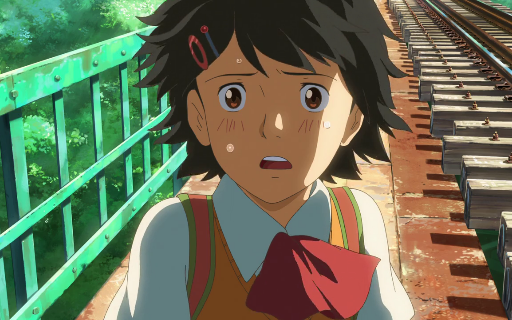

# Awesome Research on AI for Animation

This repository includes research on AI for cel/cel-look/illust-look Animation.

## Methods
### Inbetweening

**ToonCrafter: Generative Cartoon Interpolation** [arXiv 2024]\
*Jinbo Xing, Hanyuan Liu, Menghan Xia, Yong Zhang, Xintao Wang, Ying Shan, Tien-Tsin Wong*\
[[Paper]](https://arxiv.org/abs/2405.17933)
[[Code]](https://github.com/ToonCrafter/ToonCrafter)
[[Project]](https://doubiiu.github.io/projects/ToonCrafter/)
<table>
    <tr>
        <td></td>
        <td></td>
        <td></td>
    </tr>
    <tr>
        <td></td>
        <td></td>
        <td></td>
    </tr>
</table>

### Colorization
**Learning Inclusion Matching for Animation Paint Bucket Colorization** [CVPR, 2024]\
*Yuekun Dai, Shangchen Zhou, Qinyue Li, Chongyi Li, Chen Change Loy*\
[[Paper]](https://arxiv.org/abs/2403.18342)
[[Project]](https://ykdai.github.io/projects/InclusionMatching)
[[Demo]](https://www.youtube.com/watch?v=nNnPUItGvSo&ab_channel=YuekunDai)
[[Code]](https://github.com/ykdai/BasicPBC)
[[Dataset]](https://github.com/ykdai/BasicPBC/tree/main/dataset) \

## Datasets
**Sakuga-42M Dataset: Scaling Up Cartoon Research** [arXiv 2024]\
Zhenglin Pan, Yu Zhu, Yuxuan Mu*\
[[Paper]](https://drive.google.com/file/d/1aeJqsBw92ebELEpP-oFBo-kcUpBzHm_E/view)
[[Dataset]](https://huggingface.co/datasets/aidenpan/s_clips-v1.0)\
