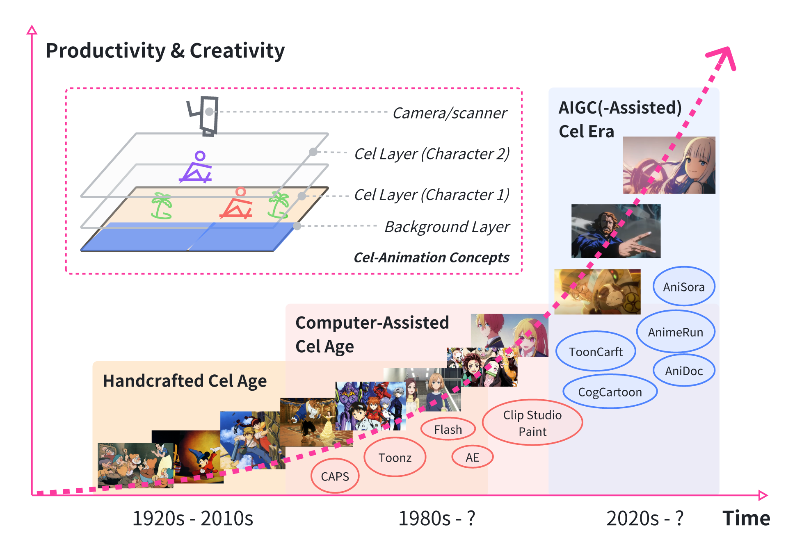

# Awesome Research on AI for Animation

This repository includes research, datasets, and other resources on AI for cel / cel-look / illust-look animation.

# 🎬 Awesome Research on AI for Animation
## 📖 Table of Contents
- 🎥 [Process of Animation Production](#process-of-animation-production)
- 🛠️ [Methods](#methods)
  - 📜 [Scripting](#-scripting)
  - 🎭 [Setting](#-setting)
  - 🖌️ [Storyboarding](#%EF%B8%8F-storyboarding)
  - 🗺️ [Layout](#%EF%B8%8F-layout)
  - 🎞️ [Keyframe Animation](#keyframe-animation)
  - 🍴 [Inbetweening](#-inbetweening)
  - 🌈 [Colorization](#-colorization)
  - 📷 [Compositing & Photography](#-compositing--photography)
  - ✂️ [Cutting (CT)](#%EF%B8%8F-cutting-ct)
  - 🎶 [Music & Sound Effects](#-music--sound-effects)
  - 🎙️ [After Record (AR) & Dubbing (DB)](#%EF%B8%8F-after-record-ar--dubbing-db)
  - 🎞️ [Cel-Animation Editing](#%EF%B8%8F-cel-animation-editing)
  - 🎨 [Cels Decomposition](-cels-decomposition)
- 📊 [Datasets](#datasets)
- 🔗 [Others](#others)
- 📁 [Related Repository](#related-repository)

## Process of Animation Production
This is the production process of traditional 2D animation. We will list these research topics roughly in this sequence.

## Methods

### 📜 Scripting

**HoLLMwood: Unleashing the Creativity of Large Language Models in Screenwriting via Role Playing** \
*Jing Chen, Xinyu Zhu, Cheng Yang, Chufan Shi, Yadong Xi, Yuxiang Zhang, Junjie Wang, Jiashu Pu, Rongsheng Zhang, Yujiu Yang, Tian Feng*\
[[Paper]](https://arxiv.org/abs/2406.11683)

**Gemini 1.5: Unlocking multimodal understanding across millions of tokens of context** \
*Gemini Team Google*\
[[Paper]](https://arxiv.org/abs/2403.05530)

**Claude 3.5 Sonnet** \
[[Link]](https://www.anthropic.com/news/claude-3-5-sonnet)

**InternVL: Scaling up Vision Foundation Models and Aligning for Generic Visual-Linguistic Tasks** [CVPR 2024]\
*Zhe Chen, Jiannan Wu, Wenhai Wang, Weijie Su, Guo Chen, Sen Xing, Muyan Zhong, Qinglong Zhang, Xizhou Zhu, Lewei Lu, Bin Li, Ping Luo, Tong Lu, Yu Qiao, Jifeng Dai* \
[[Paper]](https://arxiv.org/abs/2312.14238)
[[Code]](https://github.com/OpenGVLab/InternVL)

**Qwen-VL: A Versatile Vision-Language Model for Understanding, Localization, Text Reading, and Beyond** \
*Jinze Bai, Shuai Bai, Shusheng Yang, Shijie Wang, Sinan Tan, Peng Wang, Junyang Lin, Chang Zhou, Jingren Zhou* \
[[Paper]](https://arxiv.org/abs/2308.12966)
[[Code]](https://github.com/QwenLM/Qwen-VL)

**Gpt-4** \
*OpenAI* \
[[Report]](https://arxiv.org/abs/2303.08774)

### 🎭 Setting

**High-Resolution Image Synthesis with Latent Diffusion Models** [CVPR 2022]\
*Robin Rombach, Andreas Blattmann, Dominik Lorenz, Patrick Esser, Björn Ommer* \
[[Paper]](https://arxiv.org/abs/2112.10752)
[[Demo]](https://huggingface.co/spaces/multimodalart/latentdiffusion)
[[Code]](https://github.com/CompVis/latent-diffusion)

**MidJourney** \
[[Link]](https://www.midjourney.com/home)

### 🖌️ Storyboarding

**StoryWeaver: A Unified World Model for Knowledge-Enhanced Story Character Customization** \
*Jinlu Zhang, Jiji Tang, Rongsheng Zhang, Tangjie Lv, Xiaoshuai Sun* \
[[Paper]](https://arxiv.org/abs/2412.07375)
[[Code]](https://github.com/Aria-Zhangjl/StoryWeaver)

**Synthesizing Coherent Story with Auto-Regressive Latent Diffusion Models** [WACV 2024]\
*Xichen Pan, Pengda Qin, Yuhong Li, Hui Xue, Wenhu Chen* \
[[Paper]](https://arxiv.org/abs/2211.10950)
[[Code]](https://github.com/xichenpan/ARLDM)

**SEED-Story: Multimodal Long Story Generation with Large Language Model** \
*Shuai Yang, Yuying Ge, Yang Li, Yukang Chen, Yixiao Ge, Ying Shan, Yingcong Chen* \
[[Paper]](https://arxiv.org/abs/2407.08683)
[[Code]](https://github.com/TencentARC/SEED-Story)
[[Dataset]](https://huggingface.co/datasets/TencentARC/StoryStream)

**Make-A-Story: Visual Memory Conditioned Consistent Story Generation** \
*Tanzila Rahman, Hsin-Ying Lee, Jian Ren, Sergey Tulyakov, Shweta Mahajan, Leonid Sigal* \
[[Paper]](https://arxiv.org/abs/2211.13319)
[[Code]](https://github.com/ubc-vision/Make-A-Story)

**Make-A-Storyboard: A General Framework for Storyboard with Disentangled and Merged Control** \
*Sitong Su, Litao Guo, Lianli Gao, Heng Tao Shen, Jingkuan Song* \
[[Paper]](https://arxiv.org/abs/2312.07549)

**Animate-A-Story: Storytelling with Retrieval-Augmented Video Generation** \
*Yingqing He, Menghan Xia, Haoxin Chen, Xiaodong Cun, Yuan Gong, Jinbo Xing, Yong Zhang, Xintao Wang, Chao Weng, Ying Shan, Qifeng Chen* \
[[Paper]](https://arxiv.org/abs/2307.06940)
[[Project Page]](https://ailab-cvc.github.io/Animate-A-Story/)
[[Code]](https://github.com/AILab-CVC/Animate-A-Story)

**StoryImager: A Unified and Efficient Framework for Coherent Story Visualization and Completion** [ECCV 2024] \
*Ming Tao, Bing-Kun Bao, Hao Tang, Yaowei Wang, Changsheng Xu* \
[[Paper]](https://arxiv.org/abs/2404.05979)
[[Code]](https://github.com/tobran/StoryImager)

**VideoDirectorGPT: Consistent Multi-scene Video Generation via LLM-Guided Planning** [COLM 2024] \
*Han Lin, Abhay Zala, Jaemin Cho, Mohit Bansal*\
[[Paper]](https://arxiv.org/abs/2309.15091)
[[Project Page]](https://videodirectorgpt.github.io/)
[[Code]](https://github.com/HL-hanlin/VideoDirectorGPT)

**CustomCrafter: Customized Video Generation with Preserving Motion and Concept Composition Abilities** [AAAI 2025] \
*Tao Wu, Yong Zhang, Xintao Wang, Xianpan Zhou, Guangcong Zheng, Zhongang Qi, Ying Shan, Xi Li* \
[[Paper]](https://arxiv.org/abs/2408.13239)
[[Peoject Page]](https://customcrafter.github.io/)
[[Code]](https://github.com/WuTao-CS/CustomCrafter)

**VideoStudio: Generating Consistent-Content and Multi-Scene Videos** [ECCV 2024] \
*Fuchen Long, Zhaofan Qiu, Ting Yao, Tao Mei* \
[[Paper]](https://arxiv.org/abs/2401.01256v2)
[[Project Page]](https://vidstudio.github.io/)
[[Code]](https://github.com/FuchenUSTC/VideoStudio)

**Mind the Time: Temporally-Controlled Multi-Event Video Generation** \
*Ziyi Wu, Aliaksandr Siarohin, Willi Menapace, Ivan Skorokhodov, Yuwei Fang, Varnith Chordia, Igor Gilitschenski, Sergey Tulyakov* \
[[Paper]](https://arxiv.org/abs/2412.05263)
[[Project Page]](https://mint-video.github.io/)

**DreamRunner: Fine-Grained Storytelling Video Generation with Retrieval-Augmented Motion Adaptation** \
*Zun Wang, Jialu Li, Han Lin, Jaehong Yoon, Mohit Bansal* \
[[Paper]](https://arxiv.org/abs/2411.16657)
[[Project Page]](https://zunwang1.github.io/DreamRunner)
[[Code]](https://github.com/wz0919/DreamRunner)

**Vlogger: Make Your Dream A Vlog** [CVPR 2024] \
*Shaobin Zhuang, Kunchang Li, Xinyuan Chen, Yaohui Wang, Ziwei Liu, Yu Qiao, Yali Wang* \
[[Paper]](https://arxiv.org/abs/2401.09414)
[[Project Page]](https://zhuangshaobin.github.io/Vlogger.github.io/)
[[Code]](https://github.com/zhuangshaobin/Vlogger)

**Anim-Director: A Large Multimodal Model Powered Agent for Controllable Animation Video Generation** [SIGGRAPH Asia 2024] \
*Yunxin Li, Haoyuan Shi, Baotian Hu, Longyue Wang, Jiashun Zhu, Jinyi Xu, Zhen Zhao, Min Zhang* \
[[Paper]]](https://arxiv.org/abs/2408.09787)
[[Code]](https://github.com/HITsz-TMG/Anim-Director)

**Storyboarder.ai**\
[[Website]](https://www.storyboarder.ai/)

**CogCartoon: Towards Practical Story Visualization**\
*Zhongyang Zhu, Jie Tang*\
[[Paper]](https://arxiv.org/abs/2312.10718)

### 🗺️ Layout

**CogCartoon: Towards Practical Story Visualization** \
*Zhongyang Zhu, Jie Tang*\
[[Paper]](https://arxiv.org/abs/2312.10718)

**Sketch-Guided Scene Image Generation** \
*Tianyu Zhang, Xiaoxuan Xie, Xusheng Du, Haoran Xie*\
[[Paper]](https://arxiv.org/abs/2407.06469)

**VideoComposer: Compositional Video Synthesis with Motion Controllability** [NIPS 2023]\
*Xiang Wang, Hangjie Yuan, Shiwei Zhang, Dayou Chen, Jiuniu Wang, Yingya Zhang, Yujun Shen, Deli Zhao, Jingren Zhou*\
[[Paper]](https://arxiv.org/abs/2306.02018)
[[Project Page]](https://videocomposer.github.io/)
[[Code]](https://github.com/ali-vilab/videocomposer)

**LayoutGAN: Generating Graphic Layouts with Wireframe Discriminators** [ICLR 2019] \
*Jianan Li, Jimei Yang, Aaron Hertzmann, Jianming Zhang, Tingfa Xu*\
[[Paper]](https://arxiv.org/abs/1901.06767)
[[Code]](https://github.com/Layout-Generation/layout-generation/tree/master/LayoutGAN)

**VideoDirectorGPT: Consistent Multi-scene Video Generation via LLM-Guided Planning** [COLM 2024] \
*Han Lin, Abhay Zala, Jaemin Cho, Mohit Bansal* \
[[Paper]](https://arxiv.org/abs/2309.15091)
[[Project Page]](https://videodirectorgpt.github.io/)
[[Code]](https://github.com/HL-hanlin/VideoDirectorGPT)

**DiffSensei: Bridging Multi-Modal LLMs and Diffusion Models for Customized Manga Generation** \
*Jianzong Wu, Chao Tang, Jingbo Wang, Yanhong Zeng, Xiangtai Li, Yunhai Tong*\
[[Paper]](https://arxiv.org/abs/2412.07589)
[[Project Page]](https://jianzongwu.github.io/projects/diffsensei/)
[[Code]](https://github.com/jianzongwu/DiffSensei)
[[Dataset]](https://huggingface.co/datasets/jianzongwu/MangaZero)

**Manga Generation via Layout-controllable Diffusion** \
*Siyu Chen, Dengjie Li, Zenghao Bao, Yao Zhou, Lingfeng Tan, Yujie Zhong, Zheng Zhao*\
[[Paper]](https://arxiv.org/abs/2412.19303v1)
[[Project Page]](https://siyuch-fdu.github.io/MangaDiffusion/)
[[Code]](https://github.com/siyuch-fdu/MangaDiffusion)

**CameraCtrl: Enabling Camera Control for Text-to-Video Generation** \
*Hao He, Yinghao Xu, Yuwei Guo, Gordon Wetzstein, Bo Dai, Hongsheng Li, Ceyuan Yang*\
[[Paper]](https://arxiv.org/abs/2404.02101)
[[Project Page]](https://hehao13.github.io/projects-CameraCtrl/)
[[Demo]](https://huggingface.co/spaces/hehao13/CameraCtrl-svd)

### 🎞️ Keyframe Animation

**Animate Anyone: Consistent and Controllable Image-to-Video Synthesis for Character Animation** [CVPR 2024] \
[[Paper]](https://arxiv.org/abs/2311.17117)
[[Project Page]](https://humanaigc.github.io/animate-anyone/)
[[Code]](https://github.com/HumanAIGC/AnimateAnyone)

**Champ: Controllable and Consistent Human Image Animation with 3D Parametric Guidance** \
*Shenhao Zhu, Junming Leo Chen, Zuozhuo Dai, Qingkun Su, Yinghui Xu, Xun Cao, Yao Yao, Hao Zhu, Siyu Zhu* \
[[Paper]](https://arxiv.org/abs/2403.14781)
[[Project Page]](https://fudan-generative-vision.github.io/champ/#/)
[[Code]](https://github.com/fudan-generative-vision/champ)

**MimicMotion: High-Quality Human Motion Video Generation with Confidence-aware Pose Guidance** \
*Yuang Zhang, Jiaxi Gu, Li-Wen Wang, Han Wang, Junqi Cheng, Yuefeng Zhu, Fangyuan Zou*\
[[Paper]](https://arxiv.org/abs/2406.19680)
[[Project Page]](https://tencent.github.io/MimicMotion/)
[[code]](https://github.com/tencent/MimicMotion)

**Animate-X: Universal Character Image Animation with Enhanced Motion Representation** \
*Shuai Tan, Biao Gong, Xiang Wang, Shiwei Zhang, Dandan Zheng, Ruobing Zheng, Kecheng Zheng, Jingdong Chen, Ming Yang* \
[[Paper]](https://arxiv.org/abs/2410.10306)
[[Code]](https://github.com/antgroup/animate-x)

**MikuDance: Animating Character Art with Mixed Motion Dynamics** \
*Jiaxu Zhang, Xianfang Zeng, Xin Chen, Wei Zuo, Gang Yu, Zhigang Tu* \
[[Paper]](https://arxiv.org/abs/2411.08656)
[[Project Page]](https://kebii.github.io/MikuDance/)
[[Code]](https://github.com/Kebii/MikuDance)

**Collaborative Neural Rendering using Anime Character Sheets** [IJCAI 2023] \
*Zuzeng Lin, Ailin Huang, Zhewei Huang* \
[[Paper]](https://arxiv.org/abs/2207.05378)
[[Code]](https://github.com/megvii-research/IJCAI2023-CoNR)
[[dataset]](https://github.com/P2Oileen/CoNR_Dataset)

### 📷 Compositing & Photography

**Scaling In-the-Wild Training for Diffusion-based Illumination Harmonization and Editing by Imposing Consistent Light Transport**
[[Paper]](https://openreview.net/forum?id=u1cQYxRI1H)

**DoveNet: Deep Image Harmonization via Domain Verification** [CVPR 2020]\
*Wenyan Cong, Jianfu Zhang, Li Niu, Liu Liu, Zhixin Ling, Weiyuan Li, Liqing Zhang*\
[[Paper]](https://arxiv.org/abs/1911.13239)
[[Code]](https://github.com/bcmi/Image-Harmonization-Dataset-iHarmony4)
[[Demo]](https://bcmi.sjtu.edu.cn/home/niuli/demo_image_composition/)
[[Dataset(Baidu Cloud(access code: kqz3))]](https://pan.baidu.com/s/1xEN0Xrv_MbuKT0ZqsipeEg)
[[Dataset(OneDrive)]](https://1drv.ms/f/s!AohNSvvkuxZmgTHOraRzo5-X3nMp?e=bQQKkR)

**High-Resolution Image Harmonization via Collaborative Dual Transformations** [CVPR 2022]\
*Wenyan Cong, Xinhao Tao, Li Niu, Jing Liang, Xuesong Gao, Qihao Sun, Liqing Zhang*\
[[Paper]](https://arxiv.org/abs/2109.06671)
[[Code]](https://github.com/bcmi/CDTNet-High-Resolution-Image-Harmonization)

**PCT-Net: Full Resolution Image Harmonization Using Pixel-Wise Color Transformations** [CVPR 2023]\
*Guerreiro, Julian Jorge Andrade and Nakazawa, Mitsuru and Stenger, Bj\"orn*\
[[Paper]](https://openaccess.thecvf.com/content/CVPR2023/papers/Guerreiro_PCT-Net_Full_Resolution_Image_Harmonization_Using_Pixel-Wise_Color_Transformations_CVPR_2023_paper.pdf)
[[Code]](https://github.com/rakutentech/PCT-Net-Image-Harmonization/)

**SSH: A Self-Supervised Framework for Image Harmonization** [ICCV 2021]\
*Yifan Jiang, He Zhang, Jianming Zhang, Yilin Wang, Zhe Lin, Kalyan Sunkavalli, Simon Chen, Sohrab Amirghodsi, Sarah Kong, Zhangyang Wang*\
[[Paper]](https://arxiv.org/abs/2108.06805)
[[Code]](https://github.com/VITA-Group/SSHarmonization)

**Thinking Outside the BBox: Unconstrained Generative Object Compositing** [ECCV 2024]\
*Gemma Canet Tarrés, Zhe Lin, Zhifei Zhang, Jianming Zhang, Yizhi Song, Dan Ruta, Andrew Gilbert, John Collomosse, Soo Ye Kim*\
[[Paper]](https://arxiv.org/abs/2409.04559)

**Dr.Bokeh: DiffeRentiable Occlusion-aware Bokeh Rendering** \
*Yichen Sheng, Zixun Yu, Lu Ling, Zhiwen Cao, Cecilia Zhang, Xin Lu, Ke Xian, Haiting Lin, Bedrich Benes*\
[[Paper]](https://arxiv.org/abs/2308.08843)
[[Code]](https://github.com/ShengCN/DrBokeh-Src)

**Floating No More: Object-Ground Reconstruction from a Single Image** \
*Yunze Man, Yichen Sheng, Jianming Zhang, Liang-Yan Gui, Yu-Xiong Wang*\
[[Paper]](https://arxiv.org/abs/2407.18914)
[[Project Page]](https://yunzeman.github.io/ORG/)

**ObjectDrop: Bootstrapping Counterfactuals for Photorealistic Object Removal and Insertion** \
*Daniel Winter, Matan Cohen, Shlomi Fruchter, Yael Pritch, Alex Rav-Acha, Yedid Hoshen*\
[[Paper]](https://arxiv.org/abs/2403.18818)
[[Peoject Page]](https://objectdrop.github.io/)

**Alchemist: Parametric Control of Material Properties with Diffusion Models** [CVPR 2024]\
*Prafull Sharma, Varun Jampani, Yuanzhen Li, Xuhui Jia, Dmitry Lagun, Fredo Durand, William T. Freeman, Mark Matthews*\
[[Paper]](https://arxiv.org/abs/2312.02970)
[[Project Page]](https://www.prafullsharma.net/alchemist/)

**DisenStudio: Customized Multi-Subject Text-to-Video Generation with Disentangled Spatial Control** [ACMMM 2024]\
*Hong Chen, Xin Wang, Yipeng Zhang, Yuwei Zhou, Zeyang Zhang, Siao Tang, Wenwu Zhu*\
[[Paper]](https://mn.cs.tsinghua.edu.cn/xinwang/PDF/papers/2024_DisenStudio%20Customized%20Multi-Subject%20Text-to-Video%20Generation%20with%20Disentangled%20Spatial%20Control.pdf)
[[Code]](https://github.com/forchchch/disenstudio.github.io?tab=readme-ov-file)

**SSN: Soft Shadow Network for Image Compositing** [CVPR 2021]\
*Yichen Sheng, Jianming Zhang, Bedrich Benes*\
[[Paper]](https://arxiv.org/abs/2007.08211)
[[Project Page]](https://shengcn.github.io/SSN/)
[[Code]](https://github.com/ShengCN/SSN_SoftShadowNet)

### ✂️ Cutting (CT)

**Multi-modal Segment Assemblage Network for Ad Video Editing with Importance-Coherence Reward** [ACCV 2022]\
*Yunlong Tang, Siting Xu, Teng Wang, Qin Lin, Qinglin Lu, Feng Zheng*\
[[Paper]](https://arxiv.org/abs/2209.12164v1)
[[Code]](https://github.com/yunlong10/Ads-1k)

**Reframe Anything: LLM Agent for Open World Video Reframing** \
*Jiawang Cao, Yongliang Wu, Weiheng Chi, Wenbo Zhu, Ziyue Su, Jay Wu*\
[[Paper]](https://arxiv.org/abs/2403.06070)

**OpusClip** \
[[Website]](https://www.opus.pro/)

### 🎶 Music & Sound Effects

**Foley Music: Learning to Generate Music from Videos** [ECCV 2020]\
*Chuang Gan, Deng Huang, Peihao Chen, Joshua B. Tenenbaum, Antonio Torralba*\
[[Paper]](https://arxiv.org/abs/2007.10984)
[[Code]](https://github.com/chuangg/Foley-Music)

**Video2Music: Suitable Music Generation from Videos using an Affective Multimodal Transformer model** 
*Video2Music: Suitable Music Generation from Videos using an Affective Multimodal Transformer model*\
[[Paper]](https://arxiv.org/abs/2311.00968)
[[Demo]](https://huggingface.co/spaces/amaai-lab/video2music)
[[Project Page]](https://amaai-lab.github.io/Video2Music/)
[[Code]](https://github.com/amaai-lab/video2music)
[[Dataset]](https://zenodo.org/records/10057093)

**V2Meow: Meowing to the Visual Beat via Video-to-Music Generation** [AAAI 2024]\
*Kun Su, Judith Yue Li, Qingqing Huang, Dima Kuzmin, Joonseok Lee, Chris Donahue, Fei Sha, Aren Jansen, Yu Wang, Mauro Verzetti, Timo I. Denk*\
[[Paper]](https://arxiv.org/abs/2305.06594)
[[Project Page]](https://google-research.github.io/noise2music/v2meow/)

**MeLFusion: Synthesizing Music from Image and Language Cues using Diffusion Models** [CVPR 2024]\
*Sanjoy Chowdhury, Sayan Nag, K J Joseph, Balaji Vasan Srinivasan, Dinesh Manocha*\
[[Paper]](https://arxiv.org/abs/2406.04673)
[[Prpject Page]](https://schowdhury671.github.io/melfusion_cvpr2024/)
[[Code]](https://github.com/schowdhury671/melfusion/tree/main)
[[Dataset]](https://umd0-my.sharepoint.com/personal/sanjoyc_umd_edu/_layouts/15/onedrive.aspx?id=%2Fpersonal%2Fsanjoyc%5Fumd%5Fedu%2FDocuments%2FMeLFusion%20datasets&ga=1)

**VidMuse: A Simple Video-to-Music Generation Framework with Long-Short-Term Modeling** \
*Zeyue Tian, Zhaoyang Liu, Ruibin Yuan, Jiahao Pan, Qifeng Liu, Xu Tan, Qifeng Chen, Wei Xue, Yike Guo*\
[[Paper]](https://arxiv.org/abs/2406.04321)
[[Code]](https://github.com/ZeyueT/VidMuse/)

**Taming Visually Guided Sound Generation** [BMVC 2021]\
*Vladimir Iashin, Esa Rahtu*\
[[Paper]](https://arxiv.org/abs/2110.08791)
[[Project Page]](https://v-iashin.github.io/SpecVQGAN)
[[Demo]](https://colab.research.google.com/drive/1pxTIMweAKApJZ3ZFqyBee3HtMqFpnwQ0?usp=sharing)
[[Code]](https://github.com/v-iashin/SpecVQGAN)

**I Hear Your True Colors: Image Guided Audio Generation** [ICASSP 2023]\
*Roy Sheffer, Yossi Adi*\
[[Paper]](https://arxiv.org/abs/2211.03089)
[[Project Page]](https://pages.cs.huji.ac.il/adiyoss-lab/im2wav/)
[[Code]](https://github.com/RoySheffer/im2wav)

**FoleyGen: Visually-Guided Audio Generation** \
*Xinhao Mei, Varun Nagaraja, Gael Le Lan, Zhaoheng Ni, Ernie Chang, Yangyang Shi, Vikas Chandra*\
[[Paper]](https://arxiv.org/abs/2309.10537)
[[Project Page]](https://xinhaomei.github.io/foleygen_demo/)

**Diff-Foley: Synchronized Video-to-Audio Synthesis with Latent Diffusion Models** [NeurIPS 2023]\
*Simian Luo, Chuanhao Yan, Chenxu Hu, Hang Zhao*\
[[Paper]](https://arxiv.org/abs/2306.17203)
[[Project Page]](https://diff-foley.github.io/)
[[Code]](https://github.com/luosiallen/Diff-Foley)

**Action2Sound: Ambient-Aware Generation of Action Sounds from Egocentric Videos** [ECCV 2024]\
*Changan Chen, Puyuan Peng, Ami Baid, Zihui Xue, Wei-Ning Hsu, David Harwath, Kristen Grauman*\
[[Paper]](https://arxiv.org/abs/2406.09272)
[[Project Page]](https://vision.cs.utexas.edu/projects/action2sound/)
[[Code]](https://github.com/ChanganVR/action2sound)

### 🎙️ After Record (AR) & Dubbing (DB)

**StyleDubber: Towards Multi-Scale Style Learning for Movie Dubbing** 【ACL 2024]\
*Gaoxiang Cong, Yuankai Qi, Liang Li, Amin Beheshti, Zhedong Zhang, Anton van den Hengel, Ming-Hsuan Yang, Chenggang Yan, Qingming Huang*\
[[Paper]](https://arxiv.org/abs/2402.12636)
[[[Code]](https://github.com/GalaxyCong/StyleDubber)

**ANIM-400K: A Large-Scale Dataset for Automated End-To-End Dubbing of Video** [ICASSP 2024]\
*Kevin Cai, Chonghua Liu, David M. Chan*\
[[Paper]](https://arxiv.org/pdf/2401.05314)
[[Code]](https://github.com/davidmchan/Anim400K)
[[Dataset]](https://huggingface.co/datasets/davidchan/anim400k)

**EmoDubber: Towards High Quality and Emotion Controllable Movie Dubbing** \
*Gaoxiang Cong, Jiadong Pan, Liang Li, Yuankai Qi, Yuxin Peng, Anton van den Hengel, Jian Yang, Qingming Huang*\
[[Paper]](https://arxiv.org/abs/2412.08988)
[[Project Page & Demo]](https://galaxycong.github.io/EmoDub/)

**From Speaker to Dubber: Movie Dubbing with Prosody and Duration Consistency Learning** [ACM MM24]\
*Zhedong Zhang, Liang Li, Gaoxiang Cong, Haibing Yin, Yuhan Gao, Chenggang Yan, Anton van den Hengel, Yuankai Qi*\
[[Paper]](https://dl.acm.org/doi/10.1145/3664647.3680777)
[[Code]](https://github.com/ZZDoog/Speaker2Dubber/tree/main)

**Learning to Dub Movies via Hierarchical Prosody Models** [[CVPR 2023]]\
*Gaoxiang Cong, Liang Li, Yuankai Qi, Zhengjun Zha, Qi Wu, Wenyu Wang, Bin Jiang, Ming-Hsuan Yang, Qingming Huang*\
[[Paper]](https://arxiv.org/abs/2212.04054)
[[Code]](https://github.com/GalaxyCong/HPMDubbing)

**V2C: Visual Voice Cloning** [CVPR 2022]\
*Qi Chen, Yuanqing Li, Yuankai Qi, Jiaqiu Zhou, Mingkui Tan, Qi Wu*\
[[Paper]](https://arxiv.org/abs/2111.12890)
[[Code]](https://github.com/chenqi008/V2C)

### 🎨 Genga

### 🍴 Inbetweening

**ToonCrafter: Generative Cartoon Interpolation** [arXiv 2024]\
*Jinbo Xing, Hanyuan Liu, Menghan Xia, Yong Zhang, Xintao Wang, Ying Shan, Tien-Tsin Wong*\
[[Paper]](https://arxiv.org/abs/2405.17933)
[[Code]](https://github.com/ToonCrafter/ToonCrafter)
[[Project]](https://doubiiu.github.io/projects/ToonCrafter/)
<table>
    <tr>
        <td></td>
        <td></td>
        <td></td>
    </tr>
    <tr>
        <td></td>
        <td></td>
        <td></td>
    </tr>
</table>

**Joint Stroke Tracing and Correspondence for 2D Animation** [SIGGRAPH 2024]\
*Haoran Mo, Chengying Gao, Ruomei Wang*\
[[Paper]](https://dl.acm.org/doi/10.1145/3649890)
[[Project]](https://markmohr.github.io/JoSTC/)
[[Code]](https://github.com/MarkMoHR/JoSTC)

**Deep Geometrized Cartoon Line Inbetweening** [ICCV 2023]\
*Li Siyao, Tianpei Gu, Weiye Xiao, Henghui Ding, Ziwei Liu, Chen Change Loy*\
[[Paper]](https://openaccess.thecvf.com/content/ICCV2023/papers/Siyao_Deep_Geometrized_Cartoon_Line_Inbetweening_ICCV_2023_paper.pdf)
[[Demo]](https://www.youtube.com/watch?v=iUF-LsqFKpI&feature=youtu.be)
[[Code]](https://github.com/lisiyao21/AnimeInbet)
[[Dataset]](https://drive.google.com/file/d/1SNRGajIECxNwRp6ZJ0IlY7AEl2mRm2DR/view)

**Exploring Inbetween Charts with Trajectory-Guided Sliders for Cutout Animation** [MTA 2023]\
*T Fukusato, A Maejima, T Igarashi, T Yotsukura*\
[[Paper]](https://link.springer.com/article/10.1007/s11042-023-17354-x)

**Enhanced Deep Animation Video Interpolation** [arXiv 2022]\
*Wang Shen, Cheng Ming, Wenbo Bao, Guangtao Zhai, Li Chen, Zhiyong Gao*\
[[Paper]](https://arxiv.org/abs/2206.12657)

**Improving the Perceptual Quality of 2D Animation Interpolation** [arXiv 2021]\
*Shuhong Chen, Matthias Zwicker*\
[[Paper]](https://arxiv.org/abs/2111.12792)

**Deep Animation Video Interpolation in the Wild** [arXiv 2021]\
*Li Siyao, Shiyu Zhao, Weijiang Yu, Wenxiu Sun, Dimitris N. Metaxas, Chen Change Loy, Ziwei Liu*\
[[Paper]](https://arxiv.org/abs/2104.02495)
[[Code]](https://github.com/lisiyao21/AnimeInterp/)
[[Dataset]](https://github.com/lisiyao21/AnimeInterp/)

**Deep Sketch-Guided Cartoon Video Inbetweening** [arXiv 2020]\
*Xiaoyu Li, Bo Zhang, Jing Liao, Pedro V. Sander*\
[[Paper]](https://arxiv.org/abs/2008.04149)

**Optical Flow Based Line Drawing Frame Interpolation Using Distance Transform to Support Inbetweenings** [IEEE 2019]\
*Rei Narita, Keigo Hirakawa, Kiyoharu Aizawa*\
[[Paper]](https://ieeexplore.ieee.org/document/8803506)

**DiLight: Digital Light Table – Inbetweening for 2D Animations Using Guidelines** [Elsevier 2017]\
*Leonardo Carvalho, Ricardo Marroquim, Emilio Vital Brazil*\
[[Paper]](https://www.sciencedirect.com/science/article/abs/pii/S0097849317300390)

### 🌈 Colorization
**Learning Inclusion Matching for Animation Paint Bucket Colorization** [CVPR 2024]\
*Yuekun Dai, Shangchen Zhou, Qinyue Li, Chongyi Li, Chen Change Loy*\
[[Paper]](https://arxiv.org/abs/2403.18342)
[[Project]](https://ykdai.github.io/projects/InclusionMatching)
[[Demo]](https://www.youtube.com/watch?v=nNnPUItGvSo&ab_channel=YuekunDai)
[[Code]](https://github.com/ykdai/BasicPBC)
[[Dataset]](https://github.com/ykdai/BasicPBC/tree/main/dataset)\

**AniDoc: Animation Creation Made Easier** [Arxiv 2024]\
*Yihao Meng, Hao Ouyang, Hanlin Wang, Qiuyu Wang, Wen Wang, Ka Leong Cheng, Zhiheng Liu, Yujun Shen, Huamin Qu*\
[[Paper]](https://arxiv.org/pdf/2412.14173)
[[Project]](https://yihao-meng.github.io/AniDoc_demo/)
[[Code]](https://github.com/yihao-meng/AniDoc)

**ToonCrafter: Generative Cartoon Interpolation** [TOG 2024]\
*Jinbo Xing, Hanyuan Liu, Menghan Xia, Yong Zhang, Xintao Wang, Ying Shan, Tien-Tsin Wong*\
[[Paper]](https://arxiv.org/abs/2405.17933)
[[Project]](https://doubiiu.github.io/projects/ToonCrafter/)
[[Code]](https://github.com/Doubiiu/ToonCrafter)

**VToonify: Controllable High-Resolution Portrait Video Style Transfer** [TOG 2022]\
*Shuai Yang, Liming Jiang, Ziwei Liu, Chen Change Loy*\
[[Paper]](https://arxiv.org/abs/2209.11224)
[[Project]](https://www.mmlab-ntu.com/project/vtoonify/)
[[Code]](https://github.com/williamyang1991/VToonify)

**StyleGANEX: StyleGAN-Based Manipulation Beyond Cropped Aligned Faces** [ICCV 2023]\
*Shuai Yang, Liming Jiang, Ziwei Liu, Chen Change Loy*\
[[Paper]](https://arxiv.org/abs/2303.06146)
[[Project]](https://www.mmlab-ntu.com/project/styleganex/)
[[Code]](https://github.com/williamyang1991/StyleGANEX)
[[Demo]](https://www.youtube.com/watch?v=8oK0TXQmxg8)

**FRESCO: Spatial-Temporal Correspondence for Zero-Shot Video Translation** [CVPR 2024]\
*Shuai Yang, Yifan Zhou, Ziwei Liu, Chen Change Loy*\
[[Paper]](https://openaccess.thecvf.com/content/CVPR2024/papers/Yang_FRESCO_Spatial-Temporal_Correspondence_for_Zero-Shot_Video_Translation_CVPR_2024_paper.pdf)
[[Project]](https://www.mmlab-ntu.com/project/fresco/)
[[Code]](https://github.com/williamyang1991/FRESCO)
[[Demo]](https://www.youtube.com/watch?v=jLnGx5H-wLw)

**TokenFlow: Consistent Diffusion Features for Consistent Video Editing** [ICLR 2024]\
*Michal Geyer, Omer Bar-Tal, Shai Bagon, Tali Dekely*\
[[Paper]](https://arxiv.org/abs/2307.10373)
[[Project]](https://diffusion-tokenflow.github.io/)
[[Code]](https://github.com/omerbt/TokenFlow)
[[Demo]](https://huggingface.co/spaces/weizmannscience/tokenflow)

**PromptFix: You Prompt and We Fix the Photo** [NIPS 2024]\
*Yongsheng Yu, Ziyun Zeng, Hang Hua, Jianlong Fu, Jiebo Luo*\
[[Paper]](https://arxiv.org/abs/2405.16785)
[[Project]](https://www.yongshengyu.com/PromptFix-Page/)
[[Code]](https://github.com/yeates/PromptFix)

**LVCD: Reference-based Lineart Video Colorization with Diffusion Models** [TOG 2024]\
*Zhitong Huang, Mohan Zhang, Jing Liao*\
[[Paper]](https://arxiv.org/abs/2409.12960)
[[Project]](https://luckyhzt.github.io/lvcd)
[[Code]](https://github.com/luckyhzt/LVCD)

**Coloring Anime Line Art Videos with Transformation Region Enhancement Network** [Pattern Recognition 2023]\
*Ning Wang, Muyao Niu, Zhi Dou, Zhihui Wang, Zhiyong Wang, Zhaoyan Ming, Bin Liu, Haojie Li*\
[[Paper]](https://www.sciencedirect.com/science/article/abs/pii/S0031320323002625)

**SketchBetween: Video-to-Video Synthesis for Sprite Animation via Sketches** [ECCV 2022]\
*Dagmar Lukka Loftsdóttir, Matthew Guzdial*\
[[Paper]](https://arxiv.org/abs/2209.00185)
[[Code]](https://github.com/ribombee/SketchBetween)

**Animation Line Art Colorization Based on Optical Flow Method** [SSNR 2022]\
*Yifeng Yu, Jiangbo Qian, Chong Wang, Yihong Dong, Baisong Liu*\
[[Paper]](https://papers.ssrn.com/sol3/papers.cfm?abstract_id=4202289)

**The Animation Transformer: Visual Correspondence via Segment Matching** [arXiv 2021]\
*Evan Casey, Víctor Pérez, Zhuoru Li, Harry Teitelman, Nick Boyajian, Tim Pulver, Mike Manh, William Grisaitis*\
[[Paper]](https://arxiv.org/abs/2109.02614)
[[Demo]](https://cadmium.app/)

**Artist-Guided Semiautomatic Animation Colorization** [arXiv 2020]\
*Harrish Thasarathan, Mehran Ebrahimi*\
[[Paper]](https://arxiv.org/abs/2006.13717)

**Line Art Correlation Matching Feature Transfer Network for Automatic Animation Colorization** [arXiv 2020]\
*Zhang Qian, Wang Bo, Wen Wei, Li Hai, Liu Jun Hui*\
[[Paper]](https://arxiv.org/abs/2004.06718)

**Deep Line Art Video Colorization with a Few References** [arXiv 2020]\
*Min Shi, Jia-Qi Zhang, Shu-Yu Chen, Lin Gao, Yu-Kun Lai, Fang-Lue Zhang*\
[[Paper]](https://arxiv.org/abs/2003.10685)

**Automatic Temporally Coherent Video Colorization** [arXiv 2019]\
*Harrish Thasarathan, Kamyar Nazeri, Mehran Ebrahimi*\
[[Paper]](https://arxiv.org/abs/1904.09527)
[[Code]](https://github.com/Harry-Thasarathan/TCVC)

**Toona**\
[[Website]](https://toona.io/)

### 🎞️ Cel-Animation Editing

**Re:Draw -- Context Aware Translation as a Controllable Method for Artistic Production** [TBA 2024]\
*Joao Liborio Cardoso, Francesco Banterle, Paolo Cignoni, Michael Wimmer*\
[[Paper]](https://arxiv.org/abs/2401.03499)

**Scaling Concept With Text-Guided Diffusion Models** \
*Chao Huang, Susan Liang, Yunlong Tang, Yapeng Tian, Anurag Kumar, Chenliang Xu*\
[[paper]](https://arxiv.org/abs/2410.24151)
[[Project Page]](https://wikichao.github.io/ScalingConcept/)
[[Code]](https://github.com/WikiChao/ScalingConcept)

### 🎨 Cels Decomposition

**Sprite-from-Sprite: Cartoon Animation Decomposition with Self-supervised Sprite Estimation** [ACM 2022]\
*Lvmin Zhang, Tien-Tsin Wong, Yuxin Liu*\
[[Paper]](https://dl.acm.org/doi/pdf/10.1145/3550454.3555439)
[[Code]](https://lllyasviel.github.io/GitPageToonDecompose/)

**Toonsynth: Example-based Synthesis of Hand-Colored Cartoon Animations** [TOG 2018]\
*M Dvorožnák, W Li, VG Kim, D Sýkora*\
[[Paper]](https://dl.acm.org/doi/abs/10.1145/3197517.3201326)

## Datasets

<!--### Comprehension, Generation-->
**Sakuga-42M Dataset: Scaling Up Cartoon Research** [arXiv 2024]\
*Zhenglin Pan, Yu Zhu, Yuxuan Mu*\
[[Paper]](https://drive.google.com/file/d/1aeJqsBw92ebELEpP-oFBo-kcUpBzHm_E/view)
[[Dataset]](https://huggingface.co/datasets/aidenpan/s_clips-v1.0)\

**Anisora: Exploring the frontiers of animation video generation in the sora era** \
*Yudong Jiang, Baohan Xu, Siqian Yang, Mingyu Yin, Jing Liu, Chao Xu, Siqi Wang, Yidi Wu, Bingwen Zhu, Xinwen Zhang, Xingyu Zheng, Jixuan Xu, Yue Zhang, Jinlong Hou, Huyang Sun*\
[[Paper]](https://arxiv.org/pdf/2412.10255)
[[Code]](https://github.com/bilibili/Index-anisora)

<!--### Dubbing-->
**ANIM-400K: A Large-Scale Dataset for Automated End-To-End Dubbing of Video** [ICASSP 2024]\
*Kevin Cai, Chonghua Liu, David M. Chan*\
[[Paper]](https://arxiv.org/pdf/2401.05314)
[[Code]](https://github.com/davidmchan/Anim400K)
[[Dataset]](https://huggingface.co/datasets/davidchan/anim400k)

**V2C: Visual Voice Cloning** [CVPR 2022]\
*Qi Chen, Yuanqing Li, Yuankai Qi, Jiaqiu Zhou, Mingkui Tan, Qi Wu*\
[[Paper]](https://arxiv.org/abs/2111.12890)
[[Code]](https://github.com/chenqi008/V2C)

<!--### Compositing, Photography-->
**DoveNet: Deep Image Harmonization via Domain Verification** [CVPR 2020]\
*Wenyan Cong, Jianfu Zhang, Li Niu, Liu Liu, Zhixin Ling, Weiyuan Li, Liqing Zhang*\
[[Paper]](https://arxiv.org/abs/1911.13239)
[[Code]](https://github.com/bcmi/Image-Harmonization-Dataset-iHarmony4)
[[Demo]](https://bcmi.sjtu.edu.cn/home/niuli/demo_image_composition/)
[[Dataset(Baidu Cloud(access code: kqz3))]](https://pan.baidu.com/s/1xEN0Xrv_MbuKT0ZqsipeEg)
[[Dataset(OneDrive)]](https://1drv.ms/f/s!AohNSvvkuxZmgTHOraRzo5-X3nMp?e=bQQKkR)

**SSH: A Self-Supervised Framework for Image Harmonization** [ICCV 2021]\
*Yifan Jiang, He Zhang, Jianming Zhang, Yilin Wang, Zhe Lin, Kalyan Sunkavalli, Simon Chen, Sohrab Amirghodsi, Sarah Kong, Zhangyang Wang*\
[[Paper]](https://arxiv.org/abs/2108.06805)
[[Code]](https://github.com/VITA-Group/SSHarmonization)
[[Dataset]](https://drive.google.com/file/d/1jBx-DBtRX8GaqMvMv-CZutK4jn9tz-fT/view)

**Intrinsic Image Harmonization** [CVPR 2021]\
*Zonghui Guo, Haiyong Zheng, Yufeng Jiang, Zhaorui Gu, Bing Zheng*\
[[Paper]](https://openaccess.thecvf.com/content/CVPR2021/papers/Guo_Intrinsic_Image_Harmonization_CVPR_2021_paper.pdf)
[[Code]](https://github.com/zhenglab/IntrinsicHarmony)
[[Dataset(Baidu Cloud(access code: akbi))]](https://pan.baidu.com/s/1DR600XJFhm8lqfHZ6mOU_A)
[[Dataset(Google Drive)]](https://drive.google.com/file/d/1-pa_9BNgIkuR0j1gcCxh8GI3XSWZN0e7/view?usp=sharing)

**Alchemist: Parametric Control of Material Properties with Diffusion Models** [CVPR 2024]\
*Prafull Sharma, Varun Jampani, Yuanzhen Li, Xuhui Jia, Dmitry Lagun, Fredo Durand, William T. Freeman, Mark Matthews*\
[[Paper]](https://arxiv.org/abs/2312.02970)
[[Project Page]](https://www.prafullsharma.net/alchemist/)

<!--### Colorization-->
**Learning Inclusion Matching for Animation Paint Bucket Colorization** [CVPR 2024]\
*Yuekun Dai, Shangchen Zhou, Qinyue Li, Chongyi Li, Chen Change Loy*\
[[Paper]](https://arxiv.org/abs/2403.18342)
[[Project]](https://ykdai.github.io/projects/InclusionMatching)
[[Demo]](https://www.youtube.com/watch?v=nNnPUItGvSo&ab_channel=YuekunDai)
[[Code]](https://github.com/ykdai/BasicPBC)
[[Dataset]](https://github.com/ykdai/BasicPBC/tree/main/dataset)

<!--### Inbetweening-->
**Deep Animation Video Interpolation in the Wild** [CVPR 2021]\
*Li Siyao, Shiyu Zhao, Weijiang Yu, Wenxiu Sun, Dimitris N. Metaxas, Chen Change Loy, Ziwei Liu*\
[[Paper]](https://arxiv.org/pdf/2104.02495)
[[Code]](https://github.com/lisiyao21/AnimeInterp/)
[[Data (Google Drive)]](https://drive.google.com/file/d/1XBDuiEgdd6c0S4OXLF4QvgSn_XNPwc-g/view) 
[[Data (OneDrive)]](https://entuedu-my.sharepoint.com/:u:/g/personal/siyao002_e_ntu_edu_sg/EY3SG0-IajxKj9HMPz__zOMBvyJdrA-SlwpyHYFkDsQtng?e=q7nGlu)
[[Video Demo]](https://www.youtube.com/watch?v=2bbujT-ZXr8)

**Deep Geometrized Cartoon Line Inbetweening** [ICCV 2023]\
*Li Siyao, Tianpei Gu, Weiye Xiao, Henghui Ding, Ziwei Liu, Chen Change Loy*\
[[Paper]](https://openaccess.thecvf.com/content/ICCV2023/papers/Siyao_Deep_Geometrized_Cartoon_Line_Inbetweening_ICCV_2023_paper.pdf)
[[Demo]](https://www.youtube.com/watch?v=iUF-LsqFKpI&feature=youtu.be)
[[Code]](https://github.com/lisiyao21/AnimeInbet)
[[Dataset]](https://drive.google.com/file/d/1SNRGajIECxNwRp6ZJ0IlY7AEl2mRm2DR/view)

**AnimeRun: 2D Animation Visual Correspondence from Open Source 3D Movies** [NeurIPS 2022]\
*Li Siyao, Yuhang Li, Bo Li, Chao Dong, Ziwei Liu, Chen Change Loy*\
[[Paper]](https://arxiv.org/abs/2211.05709)
[[Project & Dataset]](https://lisiyao21.github.io/projects/AnimeRun)
[[Code]](https://github.com/lisiyao21/AnimeRun)

## Others

**Globally Optimal Toon Tracking**\
*Haichao Zhu, Xueting Liu, Tien-Tsin Wong, Pheng-Ann Heng*\
[[Paper]](https://ttwong12.github.io/papers/toontrack/toontrack.pdf)
[[Supplementary]](https://ttwong12.github.io/papers/toontrack/supp.pdf)
[[Results Video]](https://ttwong12.github.io/papers/toontrack/result.mp4)
[[Project Page]](https://ttwong12.github.io/papers/toontrack/toontrack.html)

**Stereoscopizing Cel Animations**\
*Xueting Liu, Xiangyu Mao, Xuan Yang, Linling Zhang, Tien-Tsin Wong*\
[[Project Page]](https://ttwong12.github.io/papers/3dcel/3dcel.html)
[[Paper]](https://ttwong12.github.io/papers/3dcel/3dcel.pdf)

## Related Repository
