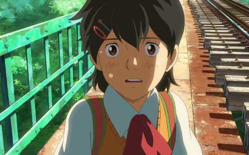

# Awesome Research on AI for Animation

This repository includes research on AI for cel/cel-look/illust-look Animation.

## Methods
### Interpolation
|||
|-|-|
|**ToonCrafter: Generative Cartoon Interpolation** *Jinbo Xing, Hanyuan Liu, Menghan Xia, Yong Zhang, Xintao Wang, Ying Shan, Tien-Tsin Wong* [[Paper]](https://arxiv.org/abs/2405.17933) [[GitHub]](https://github.com/ToonCrafter/ToonCrafter) [[Project Page]](https://doubiiu.github.io/projects/ToonCrafter/) [arXiv 2024] | <table><tr><td></td><td></td></tr><tr><td></td><td></td></tr><tr><td></td><td></td></tr></table>|

## Datasets
|||
|-|-|
|**Sakuga-42M Dataset: Scaling Up Cartoon Research** *Zhenglin Pan, Yu Zhu, Yuxuan Mu* [[Paper]](https://drive.google.com/file/d/1aeJqsBw92ebELEpP-oFBo-kcUpBzHm_E/view)[[Dataset]](https://huggingface.co/datasets/aidenpan/s_clips-v1.0)||